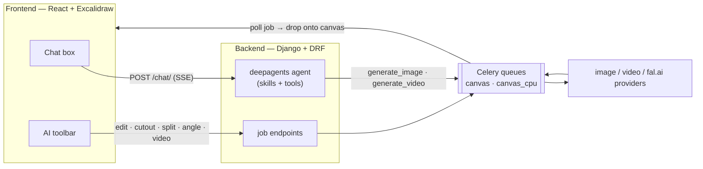

<div align="center">
  <h1>Canvex</h1>
  <p>Canvex is an infinite-canvas LLM agent that can chat, use skills, generate, and edit images and videos. It is built specifically for e-commerce sellers and the designers who make their images. With scene management, you can organize multiple canvases for different projects.</p>
  <p>
    <a href="https://react.dev"></a>
    <a href="https://www.djangoproject.com/"></a>
    <a href="https://www.postgresql.org/"></a>
    <a href="https://redis.io/"></a>
    <a href="https://github.com/langchain-ai/deepagents"></a>
  </p>
</div>

Language: [中文](./README.md)

## Features

- **Chat to create** — type a prompt into the chat box at the bottom of the canvas; the LLM agent generates one or more images (or a video) and drops them onto the board. The chat box (the transcript itself) is a frame on the canvas — drag it, zoom it and scroll it like any other element.
- **AI toolbar on any image** — select an image and a floating toolbar appears, built on Excalidraw's own selection boxes and arrows:
  - **Edit** — change the style or the content by prompt.
  - **Cutout** — one click strips the background and lifts the subject out.
  - **Split** — one image becomes two, stacked: the cut-out subject + a clean background with the subject removed.
  - **Angle** — move the camera and re-render the shot from a new viewpoint (fal.ai LoRA).
  - **Video** — turn a still into a clip. Duration, aspect ratio and quality tier **all follow the model you picked**
  - **Mockup** — wrap a design image onto another image using depth, with Depth / Mask / Opacity controls.
  - **Merge / Adjust / Download / Send to chat** — flatten a selection locally, a Lightroom-style colour panel, export the canvas, or attach an image as a reference for the LLM agent.
- **Combine several images** — marquee-select up to 8 images and the Image tab turns into "Combine N images…"; all of them go to the API provider together. The other tools are single-image only, so they grey out while more than one image is selected.
- **Box & arrow annotations** — precise image editing: draw a box, an arrow or a text label on the image to point at the region you want changed.
- **Skills** — the agent decides on its own whether a skill applies (Canvex ships `image-prompt-sop`, which rewrites a vague request into a high-quality single-image prompt, and `amazon-listing-pack-sop`, which produces a coordinated 7-image Amazon listing set in one click). Install your own from **Skills** in the sidebar: drop in a `SKILL.md` (or write one right in the browser) and the agent can use it on the very next message — **no restart needed**.
- **Scenes** — multiple independent canvases in the sidebar: create, rename, delete, quick switching; edits autosave. **Pin to top is a per-browser preference** (localStorage), not synced across devices.
- **Media library** — every image / video you generate is saved, grouped per canvas; click a thumbnail to drop it back onto the current board.

## Architecture at a glance



- The chat (LLM agent) is **deepagents** (`create_deep_agent`) with two tools (`generate_image`, `generate_video`), a per-scene memory file, and progressively-disclosed **SKILL.md** skills. Chat history is replayed from the database each turn (no separate memory store required).
- Every generation is an async **job**: the API creates a `QUEUED` row and enqueues a Celery task on commit; the frontend polls the job until the result is ready, then drops it onto the canvas. Cutout is a 2-stage chain (LLM white-background pass → CPU rembg alpha).

## Setup

### 1) Clone

```bash
git clone https://github.com/Orieileen/Canvex.git
cd Canvex
```

### 2) Configure

```bash
cp .env.example .env
```

After `cp .env.example .env` the defaults work as they are — you don't need to change a single line of `.env`. **No API keys go in here** — API keys are configured inside the app (step 4). `.env` only covers infrastructure: ports, the database, and `PUBLIC_MEDIA_BASE` (see the table below).

### 3) Run (Docker)

Prerequisites: Docker + Docker Compose.

- Docker Desktop: [https://www.docker.com/products/docker-desktop/](https://www.docker.com/products/docker-desktop/)
- Docker Compose install docs: [https://docs.docker.com/compose/install/](https://docs.docker.com/compose/install/)

```bash
docker compose up -d --build
```

- Frontend: http://localhost:5173
- Backend API: http://localhost:28000

### 4) Add your channels

Providers all take different request parameters — names, values and structure alike — so Canvex ships a set of ready-made API provider request formats (this is not an ad):

1. **Chat (LLM agent) model** — Canvex ships a preset for the third-party LLM agent provider **[tu-zi](https://api.tu-zi.com/)**: sign up at tu-zi, take the API key, paste it into the Channels panel and it works. It has to be a key that supports OpenAI-style **tool calling** — one that doesn't will reply with a block of text while nothing at all happens on the canvas.
2. **Image generation · custom template** — Canvex ships a preset for the image provider **[API Mart](https://apimart.ai/)**: sign up at apimart, take the API key, paste it in. Edit, Split, and the image tool the LLM agent calls all run on this one key.
3. **Camera angle re-render** — sign up at **[fal.ai](https://fal.ai/)** for an API key; it powers the Angle (change of camera position) feature.
4. **Video generation · custom template** — Canvex ships a preset for the video provider **[API Mart](https://apimart.ai/)**: same again, sign up, take the key, paste it in.


#### How to use an API key:
**Quick setup** — open http://localhost:5173 and click **Channels** in the left sidebar. Paste that provider's key into **Quick setup** and you're done. The presets Canvex ships:

| Role | Presets |
| --- | --- |
| Chat | **[tu-zi](https://api.tu-zi.com/)**, OpenAI, Google, DeepSeek, Zhipu GLM |
| Image | **[API Mart](https://apimart.ai/)**, OpenAI, Google |
| Video | **[API Mart](https://apimart.ai/)** |
| Angle | **[fal.ai](https://fal.ai/)** |

### There are three ways to go about it:
**1. [tu-zi](https://api.tu-zi.com/) for chat / the LLM agent, [API Mart](https://apimart.ai/) for images and video, and [fal.ai](https://fal.ai/) for changing the camera angle — tested and found to be the most reliable and the cheapest for this project** — every feature here was built and verified against them, so this is the shortest path to a working install. The other chat / LLM agent presets point at first-party providers and work too, but overseas providers like OpenAI are on the pricier side and their keys are hard to buy from mainland China; besides tu-zi you can also use a domestic Chinese LLM provider, while for images apimart is cheap and stable. Angle has only one option because the viewpoint LoRA exists only on [fal.ai](https://fal.ai/).

**2. Set up a provider from a curl example** — take this route for a provider that isn't on Canvex's list: paste the example `curl` from that provider's docs and the Canvex wizard assembles the channel for you, with no JSON to write. (This may not work for every provider.)

**3. New custom provider config** — write the request template entirely yourself. You need to know every request parameter the provider takes and what to put in it, then assemble the JSON by hand and paste it into a custom provider config.

The ⚡ button at the right of a model row sends one real minimal generation. It only appears on image and Angle channels: what you need to verify on a chat channel is whether it honours the `tools` parameter, and the fastest way to do that is to say "generate an image" in the chat box; video is too slow to survive a synchronous test — for video, the first real clip on the canvas *is* the test.

Every channel has a **status dot** to the left of its name: green = the last call went through, orange = it failed, hollow = never called. Real generations update it too, not just ⚡ — so a channel that quietly breaks (expired key, exhausted quota, provider moved its endpoint) is visible at a glance instead of turning into one more mystifying failed generation. Expand a failed card and you get the provider's raw response, **with a line above it** telling you which kind of problem this is and what to change: an expired key, an exhausted balance, a model name the provider doesn't recognise and a provider that is simply down all look much the same in a raw error, and only some of them are fixed by editing a field.

Each model row can also carry its own **overrides** — that is how one channel holds forty models that disagree about durations, ratios and parameter names, instead of forty separate channels. If you are building a channel by hand: getting these knobs wrong **usually doesn't raise an error**, it just silently does nothing — a ratio sent under a key the provider never reads isn't a failure, it's a setting that never takes effect.

## Environment variables

The minimum needed to get running (full list and tuning knobs in [.env.example](./.env.example)) — Canvex already has these set up, so the table below is for reference only and needs no changes:

| Variable | Required | Notes |
| --- | --- | --- |
| `PUBLIC_MEDIA_BASE` | – | Where **your browser** reaches this backend (default `http://localhost:28000`). Used only for the absolute URLs behind Send-to-chat attachments; change it only if you open the app from another machine or domain. **Providers never fetch from it** — source images are inlined as base64 or pushed to the provider by us, so a self-hosted install needs no tunnel, CDN or public address. |
| `CANVAS_AGENT_STORE_BACKEND` | – | `memory` (default, in-process) or `postgres` (persistent agent memory; set `CANVAS_AGENT_STORE_DSN` too, and install `langgraph-checkpoint-postgres`). |
| `POSTGRES_DB` / `_USER` / `_PASSWORD` | – | All default to `canvex`. |
| `BACKEND_PORT` / `FRONTEND_PORT` | – | Host ports, default `28000` / `5173`. |
| `VITE_API_URL` | – | Backend URL the frontend calls. Docker Compose passes `http://localhost:28000`; running the dev server outside Compose without setting it falls back to `:8000` and won't connect. |


## API

All routes live under `/api/v1/canvas/`.

| Purpose | Endpoint |
| --- | --- |
| Scenes (CRUD) | `GET/POST /scenes/`, `GET/PATCH/DELETE /scenes/{id}/` |
| Chat (SSE stream) | `POST /scenes/{id}/chat/` |
| Image edit / generate | `POST /scenes/{id}/image-edit/` → `GET /image-edit-jobs/{job_id}/` |
| Split (subject + background) | `POST /scenes/{id}/split/` → two jobs, both polled at `/image-edit-jobs/{job_id}/` |
| Video | `POST /scenes/{id}/video/` → `GET /video-jobs/{job_id}/` |
| Angle (fal.ai) | `POST /scenes/{id}/angle/` → `GET /angle-jobs/{job_id}/` |
| Active jobs (resume polling) | `GET /scenes/{id}/active-jobs/` |
| Job history per scene | `GET /scenes/{id}/image-edit-jobs/`, `/video-jobs/`, `/angle-jobs/` |
| Send-to-chat upload | `POST /scenes/{id}/upload-attachment/` |
| Media library | `GET /media-library/folders/`, `GET /media-library/folders/{scene_id}/items/` |
| Skills the agent can see | `GET /skills/` |
| Install / uninstall skills | `GET` / `POST /skill-library/`, `PATCH` / `DELETE /skill-library/{id}/` |
| Channels (CRUD + nested models) | `GET/POST /image-providers/`, `GET/PATCH/PUT/DELETE /image-providers/{id}/` |
| ⚡ test a channel | `POST /image-providers/{id}/test/` — failures come back **200** too, with the raw response + a diagnosis code |
| Form schema + one-click presets | `GET /image-providers/schema/` |
| curl wizard | `POST /image-providers/wizard/parse/` (parse only, sends nothing), `POST /image-providers/wizard/probe/` (one real generation on an **unsaved** channel) |
| Models for the toolbar pickers | `GET /image-models/` (the payload contains **no** base URL / key) |

The chat endpoint streams **SSE** (`text/event-stream`, each event framed as `data: <json>\n\n`). Event types: `user_created`, `assistant_delta` (per-token text — in practice the highest-volume one), `tool_call`, `tool_result`, `canvas_asset` (`{url}`, an image the agent produced this turn that the client should place on the canvas), `assistant_final`, `assistant`, `error`, `done`.

## Backend

Tech stack: **Django + DRF + Celery + Redis + PostgreSQL + deepagents** (LangChain / LangGraph underneath).

```
backend/
├── config/                      # Django project (settings, celery, urls, wsgi/asgi)
└── studio/                      # Main app, mounted at /api/v1/canvas/
    ├── models.py                # Scene, ChatMessage, ImageEditJob/Result, VideoJob,
    │                            #   AngleJob/Result, DataFolder/DataAsset,
    │                            #   ImageProvider/ImageModel (channels), Skill
    ├── views.py  serializers.py  urls.py
    ├── tasks.py                 # Celery: canvas.image_edit_job / image_edit_cutout_job
    │                            #   / video_job / angle_job / cutout_llm_step
    ├── tests/                    # preset ↔ endpoint contracts, curl import, ratios,
    │                             #   channel diagnosis, chat protocols, request templates
    └── services/
        ├── image.py video.py                 # creates the job **only** — the provider
        │                                     #   call lives in agent/tools/, see below
        ├── angle.py                          # creates the job + calls fal.ai
        ├── image_client.py                   # OpenAI-compatible image client, built from
        │                                     #   one ImageChannel (the DB is the only
        │                                     #   source of configuration)
        ├── image_channels.py                 # the two levels of DB rows → the single
        │                                     #   ImageChannel each caller consumes; kind
        │                                     #   specs, presets, form schema
        ├── template_client.py                # actually runs a user-written request
        │                                     #   template: send, poll, dig out the result
        ├── request_template.py               # the template format itself (where placeholders go)
        ├── curl_import.py                    # a provider's example curl → that template
        ├── channel_health.py                 # writes the status dot after every round-trip
        ├── channel_diagnosis.py              # provider error → "which kind of problem"
        ├── attachments.py scenes.py billing.py (no-op) http_retry.py listings_utils.py
        └── agent/
            ├── builder.py        # create_deep_agent (model, tools, skills, memory, store)
            ├── skills.py  context.py
            ├── skill_md.py       # parse + vet an uploaded SKILL.md
            ├── tools/            # **not just the agent's tools** — every image / video job
                                  #   in the product actually runs here, toolbar ones too
                                  #   (common.py, image.py, video.py)
            └── skills/           # factory seed only — migration 0018 imports it into the
                                  #   DB, which is the runtime source of truth
                                  #   (editing these files does nothing)
```

### Async job pipeline

A generation request creates a `QUEUED` job inside a transaction and enqueues a Celery task on commit (returns `202` + `{job_id, status}` — Split returns two, one per leg). Tasks run on dedicated queues:

| Queue (worker) | Pool | Tasks |
| --- | --- | --- |
| `canvas` (`worker_canvas`) | gevent | `image_edit_job`, `video_job`, `angle_job`, `cutout_llm_step` |
| `canvas_cpu` (`worker_canvas_cpu`) | prefork | `image_edit_cutout_job` (rembg alpha, CPU-bound) |
| `excalidraw` (`worker`) | prefork | default queue |

Cutout / Split is a 2-stage chain: stage 1 (LLM, on `canvas`) produces a white-background image, stage 2 (rembg, on `canvas_cpu`) turns the white into transparent alpha. The frontend polls the job endpoints (or `/active-jobs/`) and drops results onto the canvas when they're ready. The image / video tools the chat agent calls create the same jobs — the agent answers "queued" and does not block on the render.

## FAQ

- **Check the logs** when a job fails — include all three workers:

  ```bash
  docker compose logs -f backend worker worker_canvas worker_canvas_cpu
  ```

- **The image is wrong or errors out** — check the base URL, key and model name under **Channels** in the sidebar, and test with ⚡. Video channels are configured in the same panel but have **no ⚡** (see step 4): for video, the first real clip on the canvas is the test.
- **Video looks stuck** — it probably isn't. Video providers take minutes; the polling budget for template channels runs to roughly 50 minutes, a number taken from a real API Mart run. The placeholder box stays on the canvas for the whole wait, and survives a page reload.
- **A generation failed on the source image** — it will say so: the job flips to FAILED carrying the provider's own raw error text, which the canvas shows on the placeholder card. This is **not** a `PUBLIC_MEDIA_BASE` problem — Canvex either inlines the source image as base64 or pushes it to the provider, and never expects anyone to reach your machine. The one case that still needs public reachability is an **external URL you pasted in yourself**. For image-to-video: some video providers refuse base64 *and* require a publicly fetchable URL, and for those the channel's `upload_path` points at the provider's own upload endpoint so Canvex can push the bytes there before generating. The API Mart video preset ships with this set; a hand-built video channel needs it filled in.
- **Frontend requests blocked by CORS** — keep `CORS_ALLOW_ALL_ORIGINS=true` (the default), or add your origin to `CORS_ALLOWED_ORIGINS`.
