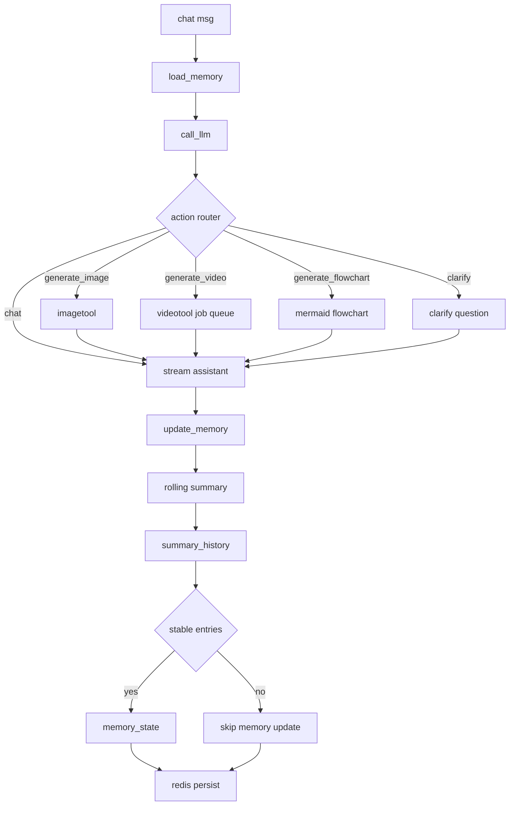

<div align="center">
  <h1>Canvex</h1>
  <p>Canvex is the scene creation module extracted from MeiRed (https://meired.com).</p>
  <p>
    <a href="https://react.dev"></a>
    <a href="https://www.djangoproject.com/"></a>
    <a href="https://redis.io/"></a>
  </p>
</div>

Language: [中文](./README.zh-CN.md)

## Core Features

- Canvas scene management: create, save, and load scene data.
- Flowcharts: quickly build process flows and structural relationships on canvas.
- Free drawing: create hand-drawn content with the brush tool.
- Import and export: import and export canvas content.
- AI Agent: drive editing workflows with natural language.
- Image generation and editing: supports text-to-image, image-to-image, and cutout workflows.
- Video generation: generate videos from prompts or reference images with job polling support.
- Text editing: add text anywhere on the canvas.
- Media job management: unified status and result retrieval for image/video jobs.

## AI Agent Graph Architecture



- The fixed main path is: `load_memory -> call_llm -> update_memory`.
- Inside `call_llm`, an action router decides whether to continue normal chat or trigger image/video/flowchart tools.
- `rolling summary` updates `summary_state` each turn and appends snapshots to `summary_history` (sliding window).
- Entries are promoted to long-term `memory_state` only after reaching the stability threshold within the window, which avoids one-off chat noise.

## 1-Minute Setup
### 1) Clone the Repository

```bash
git clone https://github.com/Orieileen/Canvex.git
cd Canvex
```

### 2) Docker Deployment
Prerequisites: `Docker`, `Docker Compose`

- Docker Desktop: [https://www.docker.com/products/docker-desktop/](https://www.docker.com/products/docker-desktop/)
- Docker Compose install docs: [https://docs.docker.com/compose/install/](https://docs.docker.com/compose/install/)

```bash
cp .env.example .env
docker compose up -d --build
```
### Required Environment Variables Before Use

In `.env`, configure these first in most cases:

| Variable | Notes | Example |
| --- | --- | --- |
| `OPENAI_API_KEY` | API key used by the LLM agent. | `sk-xxxx` |
| `OPENAI_BASE_URL` | LLM agent endpoint (OpenAI or compatible gateway). | `https://api.openai.com/v1` |
| `EXCALIDRAW_CHAT_MODEL` | Model name used by the LLM agent. | `gpt-4o-mini` |
| `MEDIA_OPENAI_API_KEY` | API key for image/video tasks. Can be the same as `OPENAI_API_KEY`. | `sk-xxxx` |
| `MEDIA_OPENAI_BASE_URL` | Endpoint for image/video tasks (media gateway). | `https://api.openai.com/v1` |
| `MEDIA_OPENAI_IMAGE_EDIT_MODEL` | Model used by image edit/cutout workflow. | `gpt-image-1.5` |
| `MEDIA_OPENAI_VIDEO_MODEL` | Model used for video generation. | `sora-2` |

Notes:

- If you use a third-party compatible gateway, set `*_BASE_URL` and model names according to that gateway's supported list.
- If chat and media use the same provider, `OPENAI_*` and `MEDIA_OPENAI_*` can share the same configuration.

After startup, open:

- Frontend: [http://localhost:5173](http://localhost:5173)
- Backend API: [http://localhost:28000](http://localhost:28000)


## Common APIs

- Scene: `/api/v1/excalidraw/scenes/`
- Chat: `/api/v1/excalidraw/scenes/{id}/chat/`
- Image edit: `/api/v1/excalidraw/scenes/{id}/image-edit/`
- Video generation: `/api/v1/excalidraw/scenes/{id}/video/`
- Job status: `/api/v1/excalidraw/image-edit-jobs/{job_id}/`, `/api/v1/excalidraw/video-jobs/{job_id}/`


## FAQ

- Media task failed: check logs

```bash
docker compose logs -f backend worker frontend
```

- If image/video results are not as expected, check model configuration, endpoint URLs, and `MEDIA_OPENAI_*` variables first.
- If frontend requests fail due to CORS, check backend CORS configuration.
