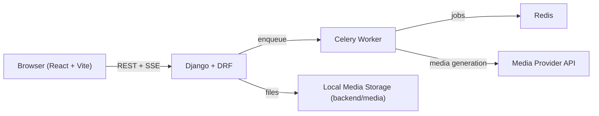

# Canvex

[](https://react.dev/)
[](https://www.djangoproject.com/)
[](https://redis.io/)
[](https://docs.docker.com/compose/)

Canvex is a standalone **Excalidraw + AI** workspace for scene creation, streaming chat, image editing, and video generation.

Language: [中文文档](./README.zh-CN.md)

## Table of Contents

- [Overview](#overview)
- [Features](#features)
- [Architecture](#architecture)
- [Quick Start (Docker)](#quick-start-docker)
- [Local Development](#local-development)
- [Environment Variables](#environment-variables)
- [API Overview](#api-overview)
- [SSE Event Format](#sse-event-format)
- [Smoke Test](#smoke-test)
- [Project Structure](#project-structure)
- [Troubleshooting](#troubleshooting)
- [GitHub Publishing Checklist](#github-publishing-checklist)

## Overview

Canvex is an Excalidraw-based AI workspace focused on canvas creation, image editing, video generation, and asset management. It works out of the box without an account login.

## Features

- Excalidraw scene CRUD (create, rename, duplicate, delete)
- AI chat with SSE streaming and non-stream fallback
- Tool callbacks for image/video generation and canvas pinning
- Image edit (including cutout) and async video polling
- Data Library folders and asset management
- Self-hosted Excalidraw assets (fonts/locales)

## Architecture



## Quick Start (Docker)

Prerequisites:
- Docker
- Docker Compose

```bash
cp .env.example .env
docker compose up -d --build
```

Default endpoints:
- Frontend: [http://localhost:5173](http://localhost:5173)
- Backend API: [http://localhost:28000](http://localhost:28000)

Useful commands:

```bash
# follow logs
docker compose logs -f backend worker frontend

# stop services
docker compose down
```

## Local Development

Frontend:

```bash
cd frontend
npm install
npm run dev
```

Backend:

```bash
cd backend
pip install -r requirements.txt
python manage.py migrate
python manage.py runserver 0.0.0.0:8000
```

Worker:

```bash
cd backend
celery -A config worker -l info -Q excalidraw -n excalidraw@%h -c 2 -Ofair --prefetch-multiplier=1
```

## Environment Variables

See `.env.example` for full descriptions.

| Category | Key Variables |
| --- | --- |
| Chat Agent | `OPENAI_API_KEY`, `OPENAI_BASE_URL`, `EXCALIDRAW_CHAT_MODEL` |
| Media Provider | `MEDIA_OPENAI_BASE_URL`, `MEDIA_OPENAI_API_KEY`, `MEDIA_OPENAI_IMAGE_MODEL`, `MEDIA_OPENAI_IMAGE_EDIT_MODEL`, `MEDIA_OPENAI_VIDEO_MODEL` |
| Video Polling | `MEDIA_OPENAI_VIDEO_TIMEOUT_SECONDS`, `MEDIA_OPENAI_VIDEO_POLL_MAX_ATTEMPTS`, `MEDIA_OPENAI_VIDEO_POLL_INTERVAL` |
| Video Compat Fallback | `MEDIA_OPENAI_VIDEO_ENABLE_COMPAT_FALLBACK` |
| Frontend | `VITE_API_URL`, `VITE_CANVEX_ASSET_PATH`, `VITE_VIDEO_POLL_MAX_ATTEMPTS`, `VITE_VIDEO_POLL_INTERVAL_MS` |
| Internal Media Fallback | `INTERNAL_MEDIA_BASE` (default: `http://backend:8000`) |

`MEDIA_OPENAI_BASE_URL` is optional. If empty, media requests fall back to `OPENAI_BASE_URL`, then OpenAI default endpoint.
If a provider rejects `POST /v1/videos`, set `MEDIA_OPENAI_VIDEO_ENABLE_COMPAT_FALLBACK=true` to auto-fallback to `POST /v1/videos/generations`.

## API Overview

| Area | Endpoints |
| --- | --- |
| Scenes | `GET/POST /api/v1/excalidraw/scenes/`, `GET/PATCH/DELETE /api/v1/excalidraw/scenes/{id}/` |
| Chat | `GET/POST /api/v1/excalidraw/scenes/{id}/chat/` (`?stream=1` for SSE) |
| Image Edit | `POST /api/v1/excalidraw/scenes/{id}/image-edit/` |
| Video | `POST /api/v1/excalidraw/scenes/{id}/video/` |
| Library | `GET/POST /api/v1/library/folders/`, `GET/PATCH/DELETE /api/v1/library/folders/{id}/`, `GET/POST /api/v1/library/assets/`, `GET/PATCH/DELETE /api/v1/library/assets/{id}/` |
| Job Polling | `GET /api/v1/excalidraw/image-edit-jobs/{job_id}/`, `GET /api/v1/excalidraw/scenes/{id}/image-edit-jobs/`, `GET /api/v1/excalidraw/video-jobs/{job_id}/`, `GET /api/v1/excalidraw/scenes/{id}/video-jobs/` |

## SSE Event Format

`/api/v1/excalidraw/scenes/{id}/chat/?stream=1` returns `text/event-stream`.

Typical `data:` payloads:

- `{"intent":"image"|"video"}`
- `{"delta":"..."}`
- `{"tool-result":{...},"tool":"...","result":{...}}`
- `{"message":{...},"done":true}`
- `{"error":"..."}`

## Smoke Test

```bash
./scripts/smoke-test.sh
# or
./scripts/smoke-test.sh http://localhost:28000
```

Recommended manual checks:

1. Scene CRUD
2. Streaming chat
3. Image generation + pinning
4. Image edit/cutout
5. Video lifecycle (queued/running/succeeded/failed)
6. Data Library upload/list

## Project Structure

```text
.
├─ docker-compose.yml
├─ .env.example
├─ scripts/
│  └─ smoke-test.sh
├─ backend/
│  ├─ config/
│  ├─ studio/
│  ├─ media/
│  └─ requirements.txt
└─ frontend/
   ├─ src/
   ├─ public/canvex-assets/
   └─ scripts/sync-canvex-assets.mjs
```

## Troubleshooting

- `process is not defined`
  - Ensure the frontend `window.process` shim and Vite `define.process.env` are enabled.
- CORS preflight failure
  - Verify backend allows `ngrok-skip-browser-warning` and related headers.
- Media generation 4xx/5xx
  - Check `backend` and `worker` logs and verify provider credentials/base URL.

## GitHub Publishing Checklist

Before publishing this repository:

1. Ensure `.env` is never committed (keep only `.env.example`).
2. Rotate any keys that were ever exposed locally or in history.
3. Confirm CORS/host settings are safe for public deployment.
4. Add a `LICENSE` file if you want open-source distribution.
5. Optionally add screenshots/GIFs under a `docs/` folder.
