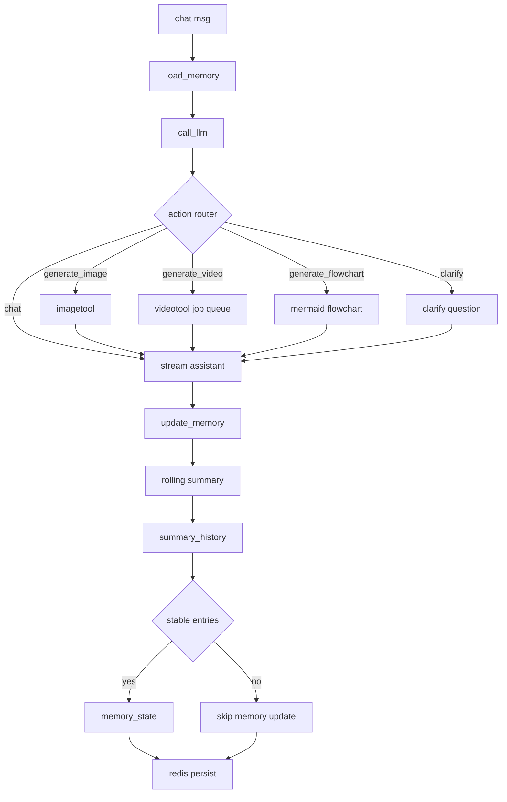

<div align="center">
  <h1>Canvex</h1>
  <p>Canvex is an infinite canvas LLM agent with scene creation capabilities</p>
  <p>
    <a href="https://react.dev"></a>
    <a href="https://www.djangoproject.com/"></a>
    <a href="https://www.mysql.com/"></a>
    <a href="https://redis.io/"></a>
  </p>
</div>

Language: [中文](./README.zh-CN.md)

## Core Features

- Canvas scene management: create, save, and load scene data.
- Flowcharts: quickly build process flows and structural relationships on canvas.
- Free drawing: create hand-drawn content with the brush tool.
- Import and export: import and export canvas content.
- AI Agent: drive editing workflows with natural language.
- Image generation and editing: supports text-to-image, image-to-image, and cutout workflows.
- Video generation: generate videos from prompts or reference images with job polling support.
- Text editing: add text anywhere on the canvas.
- Media job management: unified status and result retrieval for image/video jobs.

## AI Agent Graph Architecture


```mermaid
flowchart TD
  A["chat msg"] --> B["load_memory"]
  B --> C["call_llm"]
  C --> D{"action router"}
  D -->|chat| E["stream assistant"]
  D -->|generate_image| F["imagetool"]
  D -->|generate_video| G["videotool job queue"]
  D -->|generate_flowchart| H["mermaid flowchart"]
  D -->|clarify| I["clarify question"]
  F --> E
  G --> E
  H --> E
  I --> E
  E --> J["update_memory"]
  J --> K["rolling summary"]
  K --> L["summary_history"]
  L --> M{"stable entries"}
  M -->|yes| N["memory_state"]
  M -->|no| O["skip memory update"]
  N --> P["redis persist"]
  O --> P
```

- The fixed main path is: `load_memory -> call_llm -> update_memory`.
- Inside `call_llm`, an action router decides whether to continue normal chat or trigger image/video/flowchart tools.
- `rolling summary` updates `summary_state` each turn and appends snapshots to `summary_history` (sliding window).
- Entries are promoted to long-term `memory_state` only after reaching the stability threshold within the window, which avoids one-off chat noise.

## 1-Minute Setup
### 1) Clone the Repository

```bash
git clone https://github.com/Orieileen/Canvex.git
cd Canvex
```

### 2) Docker Deployment
Prerequisites: `Docker`, `Docker Compose`

- Docker Desktop: [https://www.docker.com/products/docker-desktop/](https://www.docker.com/products/docker-desktop/)
- Docker Compose install docs: [https://docs.docker.com/compose/install/](https://docs.docker.com/compose/install/)

```bash
cp .env.example .env
docker compose up -d --build
```
### Required Environment Variables

At minimum, configure these variables in `.env` to get started:

| Variable | Notes | Example |
| --- | --- | --- |
| `OPENAI_API_KEY` | API key for the chat LLM | `sk-xxxx` |
| `OPENAI_BASE_URL` | Chat LLM endpoint (OpenAI or compatible gateway) | `https://api.openai.com/v1` |
| `CHAT_MODEL` | Chat model name | `gpt-4o-mini` |
| `MEDIA_API_KEY` | API key for image/video tasks (can be same as `OPENAI_API_KEY`) | `sk-xxxx` |
| `MEDIA_BASE_URL` | Endpoint for image/video tasks | `https://api.openai.com/v1` |
| `MEDIA_IMAGE_MODEL` | Image generation model | `gpt-image-1.5` |
| `MEDIA_IMAGE_EDIT_MODEL` | Image editing model | `gpt-image-1.5` |
| `MEDIA_VIDEO_MODEL` | Video generation model | `sora-2` |

### Third-Party Provider Compatibility

Both image and video support two execution paths: **OpenAI SDK** (default) and **Compat endpoint** (enabled by setting `*_COMPAT_ENDPOINT`). Compat endpoints allow free combination of field names and request formats via environment variables to work with any third-party provider.

#### Image — Generation & Editing

| Variable | Description | Default |
| --- | --- | --- |
| `MEDIA_IMAGE_COMPAT_ENDPOINT` | Generation compat endpoint path (appended to `MEDIA_BASE_URL`) | unset = OpenAI SDK |
| `MEDIA_IMAGE_COMPAT_SIZE_FIELD` | Size field name for generation | `size` |
| `MEDIA_IMAGE_EDIT_COMPAT_ENDPOINT` | Image editing compat endpoint path | unset = OpenAI SDK |
| `MEDIA_IMAGE_EDIT_COMPAT_IMAGE_FIELD` | Source image field name (wrapped as array if contains `urls`) | `image_urls` |
| `MEDIA_IMAGE_EDIT_COMPAT_SIZE_FIELD` | Size field name for editing | `size` |
| `MEDIA_IMAGE_COMPAT_POLL_ENDPOINT` | Async provider poll path | same as creation endpoint |
| `MEDIA_IMAGE_POLL_INTERVAL` | Poll interval (seconds) | `3` |
| `MEDIA_IMAGE_POLL_MAX_ATTEMPTS` | Max poll attempts | `200` |

#### Video

| Variable | Description | Default |
| --- | --- | --- |
| `MEDIA_VIDEO_COMPAT_ENDPOINT` | Compat endpoint path | unset = OpenAI SDK |
| `MEDIA_VIDEO_COMPAT_CONTENT_TYPE` | Request format: `json` or `multipart` | `json` |
| `MEDIA_VIDEO_COMPAT_DURATION_FIELD` | Duration field name | `duration` |
| `MEDIA_VIDEO_COMPAT_SIZE_FIELD` | Size field name (`aspect_ratio` sends `"16:9"`, `size` sends `"1280x720"`) | `aspect_ratio` |
| `MEDIA_VIDEO_COMPAT_IMAGE_FIELD` | Image reference field name | `image` |
| `MEDIA_VIDEO_POLL_INTERVAL` | Poll interval (seconds) | `5` |
| `MEDIA_VIDEO_POLL_MAX_ATTEMPTS` | Max poll attempts | `360` |

#### Configuration Examples

<details>
<summary>OpenAI Direct (default, no extra config needed)</summary>

```env
MEDIA_BASE_URL=https://api.openai.com/v1
MEDIA_IMAGE_MODEL=gpt-image-1.5
MEDIA_VIDEO_MODEL=sora-2
```

</details>

<details>
<summary>Provider A — JSON async</summary>

```env
MEDIA_BASE_URL=https://your-provider-a.com/v1

# Image generation
MEDIA_IMAGE_MODEL=your-image-model
MEDIA_IMAGE_COMPAT_ENDPOINT=/images/generations
MEDIA_IMAGE_COMPAT_POLL_ENDPOINT=/tasks

# Image editing (same endpoint + image_urls for source image)
MEDIA_IMAGE_EDIT_MODEL=your-image-model
MEDIA_IMAGE_EDIT_COMPAT_ENDPOINT=/images/generations
MEDIA_IMAGE_EDIT_COMPAT_IMAGE_FIELD=image_urls

# Video
MEDIA_VIDEO_MODEL=sora-2
MEDIA_VIDEO_COMPAT_ENDPOINT=/videos/generations
MEDIA_VIDEO_COMPAT_CONTENT_TYPE=json
MEDIA_VIDEO_COMPAT_DURATION_FIELD=duration
MEDIA_VIDEO_COMPAT_SIZE_FIELD=aspect_ratio
```

</details>

<details>
<summary>Provider B — multipart</summary>

```env
MEDIA_BASE_URL=https://your-provider-b.com/v1

# Video
MEDIA_VIDEO_MODEL=sora-2
MEDIA_VIDEO_COMPAT_ENDPOINT=/videos
MEDIA_VIDEO_COMPAT_CONTENT_TYPE=multipart
MEDIA_VIDEO_COMPAT_DURATION_FIELD=seconds
MEDIA_VIDEO_COMPAT_SIZE_FIELD=size
MEDIA_VIDEO_COMPAT_IMAGE_FIELD=input_reference
```

</details>

### Database

Docker Compose database defaults:

| Variable | Notes | Example |
| --- | --- | --- |
| `MYSQL_DATABASE` | App database name | `canvex` |
| `MYSQL_USER` | App database user | `canvex` |
| `MYSQL_PASSWORD` | App database password | `canvex` |
| `MYSQL_HOST` | MySQL host (keep as `mysql` for Docker Compose) | `mysql` |
| `MYSQL_PORT` | MySQL port | `3306` |
| `MYSQL_ROOT_PASSWORD` | Root password for MySQL container initialization | `change-me-root-password` |

Notes:

- When using a third-party compatible gateway, set `*_BASE_URL` and model names per that gateway's documentation.
- If chat and media use the same provider, `OPENAI_*` and `MEDIA_*` can share the same configuration.
- `docker compose up -d --build` starts MySQL automatically. Existing `db.sqlite3` data is not migrated into MySQL.
- See [.env.example](./.env.example) for a full environment variable reference.

After startup, open:

- Frontend: [http://localhost:5173](http://localhost:5173)
- Backend API: [http://localhost:28000](http://localhost:28000)


## Common APIs

- Scene: `/api/v1/excalidraw/scenes/`
- Chat: `/api/v1/excalidraw/scenes/{id}/chat/`
- Image edit: `/api/v1/excalidraw/scenes/{id}/image-edit/`
- Video generation: `/api/v1/excalidraw/scenes/{id}/video/`
- Job status: `/api/v1/excalidraw/image-edit-jobs/{job_id}/`, `/api/v1/excalidraw/video-jobs/{job_id}/`


## Backend Architecture

Tech stack: Django + DRF + Celery + Redis + MySQL + LangGraph.

### Directory Structure

```
backend/
├── config/                # Django configuration
│   ├── settings.py        # Global settings, database, CORS, Celery
│   ├── celery.py          # Celery app initialization
│   └── urls.py            # Root URL routing
└── studio/                # Main app
    ├── models.py           # Data models (Scene, Job, Asset, Folder)
    ├── views.py            # API endpoints (Chat, ImageEdit, Video)
    ├── serializers.py      # DRF serializers
    ├── urls.py             # App routing
    ├── graphs.py           # AI Agent Graph (LangGraph orchestration)
    ├── memory.py           # Redis memory system (summary + memory)
    ├── tasks.py            # Celery async tasks (image editing, video generation)
    ├── video_script.py     # Video shooting script analysis
    └── tools/              # Media generation utilities
        ├── image.py        # Image generation & editing (OpenAI SDK / Compat)
        ├── video.py        # Video generation (OpenAI SDK / Compat)
        ├── assets.py       # Asset storage & folder management
        └── common.py       # Shared utilities (URL resolution, image download, OpenAI client)
```

### Dual-Path Media Generation

Both image and video support two execution paths, switched by `*_COMPAT_ENDPOINT` environment variables:

| Feature | OpenAI SDK (default) | Compat endpoint |
|---|---|---|
| Image generation | Responses API + `image_generation` | POST JSON → sync extraction or async polling |
| Image editing | Responses API + `image_generation(edit)` | POST JSON (with source image data URL) → sync/async |
| Video | `client.videos.create` → poll → download | POST JSON or multipart → poll → download |

Compat path field names (size, duration, image reference) and request format (JSON/multipart) are all configurable via environment variables. See [.env.example](./.env.example).

### Image Generation & Editing Flow

```
POST /api/v1/excalidraw/scenes/{id}/image-edit/
  → Create ExcalidrawImageEditJob (status=QUEUED)
  → Celery: run_excalidraw_image_edit_job
    → _edit_image_media(source_bytes, prompt, size)
      ├─ COMPAT_ENDPOINT set → _post_compat_image_request()
      │   ├─ Response has image data → sync extraction
      │   └─ Response has task_id   → async polling → download
      └─ Not set → Responses API (image_generation action=edit)
    → [is_cutout? → rembg background removal]
    → _save_asset() → ExcalidrawImageEditResult
```

Image generation via AI chat goes through `graphs.py → imagetool → _generate_image_media()`, a similar flow without the Job queue.

### Video Generation Flow

```
POST /api/v1/excalidraw/scenes/{id}/video/
  → Create ExcalidrawVideoJob (status=QUEUED)
  → Celery: run_excalidraw_video_job
    → _generate_video_media(payload)
      ├─ COMPAT_ENDPOINT set → JSON or multipart → poll → download
      └─ Not set → OpenAI Videos API → poll → download
    → Save thumbnail → update job (status, result_url, thumbnail_url)
    → On failure: exponential backoff retry (up to 6 times, 20s ~ 180s)
```

The frontend polls `/api/v1/excalidraw/video-jobs/{job_id}/` for task status and result URLs.

### SSE Streaming Response

The chat endpoint with `?stream=1` returns an SSE event stream:

```
data: {"intent": "image"}                        ← notify frontend of image/video generation
data: {"tool": "imagetool", "result": {...}}      ← tool execution result
data: {"delta": "text chunk"}                     ← streaming text
data: {"done": true, "message": {...}}            ← completion
```

### Memory System

Redis stores two layers of state (per workspace + scene):

- **summary_state** — current conversation summary (goal, constraints, decisions, open_questions, next_actions)
- **memory_state** — long-term memory (preferences, policies, constraints)

Summary is updated after each turn. Entries are promoted to long-term memory only after appearing ≥ `MEMORY_STABILITY_MIN_COUNT` times within the sliding window, preventing noise from being persisted.

### Celery Tasks

| Task | Trigger | Retry |
|---|---|---|
| `run_excalidraw_image_edit_job` | Image edit POST | No retry |
| `run_excalidraw_video_job` | Video POST / AI chat | Exponential backoff, up to 6 times |

## FAQ

- Media task failed: check logs

```bash
docker compose logs -f backend worker frontend
```

- If image/video results are not as expected, check model configuration, endpoint URLs, and `MEDIA_*` variables first.
- If frontend requests fail due to CORS, check backend CORS configuration.
