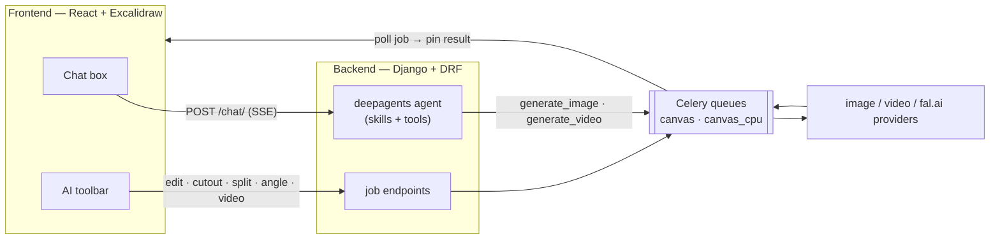

<div align="center">
  <h1>Canvex</h1>
  <p>Canvex is an infinite-canvas LLM agent that can chat, use skills, generate, and edit images and videos. With scene management, you can organize multiple canvases for different projects.</p>
  <p>
    <a href="https://react.dev"></a>
    <a href="https://www.djangoproject.com/"></a>
    <a href="https://www.postgresql.org/"></a>
    <a href="https://redis.io/"></a>
    <a href="https://github.com/langchain-ai/deepagents"></a>
  </p>
</div>

Language: [中文](./README.zh-CN.md)

## Features

- **Chat to create** — type a prompt in the box at the bottom of the canvas; the agent generates one or more images (or a video) and pins them onto the board. The transcript itself lives on the canvas as a resizable frame you can move, zoom and scroll like any other element.
- **AI toolbar on any image** — select an image to get a floating toolbar:
  - **Edit** — restyle / change anything by prompt.
  - **Cutout** — one-click background removal to a transparent subject.
  - **Split** — two stacked results from one image: a transparent subject + a clean subject-removed background.
  - **Angle** — drag a 3D cube to re-render the shot from a new camera viewpoint (fal.ai LoRA).
  - **Video** — animate a still into a clip. Duration, aspect ratio and quality tier all come from **the model you picked**, not from a fixed canvas list: veo3 only does 8-second clips, sora-2 does 4/8/12/16/20, seven models don't take 1:1, and ten don't take an aspect ratio at all — those dropdowns simply don't appear.
  - **Mockup** — wrap a design image onto another image using depth, with Depth / Mask / Opacity controls.
  - **Merge / Adjust / Download / Send to chat** — flatten a selection locally, a Lightroom-style color panel, export the canvas, or attach an image as a reference for the LLM agent.
- **Combine several images** — marquee-select up to 8 images and the Image tab switches to "Combine N images…"; the provider receives all of them. The other tools are single-image and grey out.
- **Box & arrow annotations** — fine-grained image editing: draw a box, arrow, or text label over an image to point the AI at a region.
- **Skills** — playbooks the agent loads on its own when they match your request (e.g. `image-prompt-sop` for high-quality single images, `amazon-listing-pack-sop` for a coordinated 7-image listing set). **Skills** in the sidebar installs your own: drop in a `SKILL.md` (or write one in the browser), and the agent picks it up on the next message — no restart. Disable or delete them there too; from the chat box you can also skip one for a single message.
- **Scenes** — multiple independent canvases in the sidebar: create, rename, delete, quick switching; edits autosave. **Pin to top** is a per-browser preference (localStorage), not a synced setting.
- **Originals stay original** — images you drag, paste or open go in at their **native pixel size**; Canvex uploads them through the backend instead of letting the canvas downscale them to 1440px. Toolbar and paste imports get a placement preview that follows the cursor.
- **You can watch it work** — the moment you hit generate, a box the size of the *result* is reserved on the canvas; a failure turns into a card carrying the provider's own error, not a red tombstone. Reload the page mid-render and it picks the job back up.
- **Media library** — saves every image / video you generate, grouped per canvas; click a thumbnail to drop it back onto the current board.

## Architecture at a glance


```mermaid
flowchart LR
  subgraph FE["Frontend — React + Excalidraw"]
    Chat["Chat box"]
    Bar["AI toolbar"]
  end
  subgraph BE["Backend — Django + DRF"]
    Agent["deepagents agent<br/>(skills + tools)"]
    API["job endpoints"]
  end
  Q[["Celery queues<br/>canvas · canvas_cpu"]]
  Prov["image / video / fal.ai providers"]

  Chat -->|"POST /chat/ (SSE)"| Agent
  Agent -->|"generate_image · generate_video"| Q
  Bar -->|"edit · cutout · split · angle · video"| API --> Q
  Q --> Prov --> Q
  Q -->|"poll job → pin result"| FE
```

- The chat agent is **deepagents** (`create_deep_agent`) with two tools (`generate_image`, `generate_video`), a per-scene memory file, and progressively-disclosed **SKILL.md** skills. Chat history is replayed from the database each turn (no separate memory store required).
- Every generation is an async **job**: the API creates a `QUEUED` row and enqueues a Celery task on commit; the frontend polls the job until the result is ready, then pins it. Cutout runs as a 2-stage chain (LLM white-out → CPU rembg alpha).

## Setup

### 1) Clone

```bash
git clone https://github.com/Orieileen/Canvex.git
cd Canvex
```

### 2) Configure

```bash
cp .env.example .env
```

The defaults work as-is for a local run — **no API keys go in here.** Channels are configured in the app (step 4). `.env` only holds infrastructure settings: ports, database, and `PUBLIC_MEDIA_BASE` (see the table below).

### 3) Run (Docker)

Prerequisites: Docker + Docker Compose.

- Docker Desktop: [https://www.docker.com/products/docker-desktop/](https://www.docker.com/products/docker-desktop/)
- Docker Compose install docs: [https://docs.docker.com/compose/install/](https://docs.docker.com/compose/install/)

```bash
docker compose up -d --build
```

- Frontend: http://localhost:5173
- Backend API: http://localhost:28000

### 4) Add your channels

Open http://localhost:5173 and click **Channels** in the left sidebar. Nothing works until there is at least one channel, so start here.

> **A channel** = one endpoint + one key + one request shape, with one or more **models** under it.
> **Provider** means the *company* (tu-zi, APIMart, OpenAI) — one company can back several channels.

These are the channel types you can create:

1. **Chat model** — required first; the chat box is dead without it. Point it at a provider that supports OpenAI-style **tool calling** — one that doesn't will reply with markdown and quietly do nothing on the canvas, so don't reuse an image-only key. Leave Base URL blank to use OpenAI's own endpoint. A **protocol** dropdown covers providers whose cheap "coding plan" subscriptions speak Anthropic's `/v1/messages` instead (Zhipu, DeepSeek) — a protocol mismatch returns a 404 that looks exactly like a bad key.
2. **Image generation · custom template** — needed for the Image / Split tools and for images the agent creates.
3. *(optional)* **Camera angle re-render** — a [fal.ai](https://fal.ai) key, for the 3D-cube viewpoint tool.
4. *(optional)* **Video generation · custom template**.

(You may also see two older read-only types — plain **Image generation** and **Video generation** — on channels created by earlier versions. They still run; you just can't make new ones.)

The panel has three ways in, in descending order of how much you have to know:

**Quick setup** — one-click presets grouped by role: five chat providers (tu-zi, OpenAI, Google, DeepSeek, Zhipu GLM), three image ones (APIMart, OpenAI, Google), one video (APIMart) and one Angle (fal.ai). Click one and a key field appears right there — that's the whole setup. The APIMart image and video presets arrive carrying every model from that provider's docs (dozens each) along with the ratios, durations and quality tiers each one actually accepts.

**Set up a provider from a curl example** — for anything else, paste the example `curl` from the provider's docs and the wizard builds the channel: no JSON to write. Chat and Angle channels take two steps (it just lifts the endpoint, key and model name out of the command). Image and video channels take three, because there the wizard **sends one real request** to work out where the result sits in the response and whether the provider is async — their docs usually won't tell you — and then shows you the image it just generated.

**New custom provider config** — the back door: write the request template yourself.

The ⚡ button next to a model sends one real minimal generation. It exists for image and Angle channels only: chat channels are verified by asking the chat box to generate something (what matters there is whether the provider honours the `tools` parameter), and video is too slow to survive a synchronous test — for video, the first real clip on the canvas *is* the test.

Every channel carries a **status dot** next to its name: green = the last call went through, orange = it failed, hollow = never called yet. Real generations update it too, not just ⚡ — so a channel that quietly breaks (expired key, exhausted quota, moved endpoint) shows up here instead of as one more mystifying failed generation. Expand a failed card and you get the provider's raw response **with a line above it** naming which kind of problem this is and what to change: an expired key, an exhausted balance, a model name the provider doesn't know and a provider that is simply down all look alike in a raw error, and only some of them are fixed by editing a field.

Each model row can also carry its own **Overrides** — that is how one channel holds forty models that disagree about durations, ratios and tier names, instead of forty channels. If you build a channel by hand, note that most of these knobs fail *silently* when wrong: a ratio sent under the key the provider doesn't read isn't an error, it's just a setting that never takes effect.

## Environment variables

Minimum to get started (full list and tuning knobs in [.env.example](./.env.example)):

| Variable | Required | Notes |
| --- | --- | --- |
| `PUBLIC_MEDIA_BASE` | – | Where **your browser** reaches this backend (default `http://localhost:28000`). Used for the absolute URLs behind Send-to-chat attachments; change it only if you open the app from another machine or domain. **Providers never fetch from it** — source images are inlined as base64 or uploaded to the provider, so a self-hosted install needs no tunnel, CDN or public address. |
| `CANVAS_AGENT_STORE_BACKEND` | – | `memory` (default, in-process) or `postgres` (persistent agent memory; set `CANVAS_AGENT_STORE_DSN` too, and install `langgraph-checkpoint-postgres`). |
| `POSTGRES_DB` / `_USER` / `_PASSWORD` | – | Default all `canvex`. |
| `BACKEND_PORT` / `FRONTEND_PORT` | – | Host ports, default `28000` / `5173`. |
| `VITE_API_URL` | – | Backend URL the frontend calls. Docker Compose passes `http://localhost:28000`; running the dev server outside Compose without it falls back to `:8000` and won't connect. |

Notes:

- **No channel is configured here** — chat, image generation, Angle and video all get their endpoint, API key, model name and request shape from the UI, under **Channels** in the left sidebar. Add as many channels and models as you like and switch between them from the toolbar when you generate. (The chat model is the exception: one per install, no toolbar picker.)
- **Start by adding a Chat channel** (see step 4) — the chat box is dead without one, and says so. It must point at a provider that supports OpenAI-style tool calling; one that doesn't will reply with markdown and quietly do nothing on the canvas, so don't reuse your image key for it. Leave its Base URL blank to use OpenAI's own endpoint.
- The **Angle** (multi-viewpoint) feature runs on [fal.ai](https://fal.ai): sign up, create an API key, and add it as an Angle channel in that same panel. No fal.ai account is needed for the other features.
- **Image-to-video and the `upload_path` knob** — some video providers refuse base64 source images *and* require a publicly fetchable URL. For those, the channel's `upload_path` points at the provider's own upload endpoint, and Canvex pushes the bytes there before generating (still an outbound call — your machine is never fetched). The APIMart video preset ships with this set; if you build a video channel by hand and image-to-video fails with "can't download your image", this is the field to fill in.
- Upgrading from an older version: your existing `CANVAS_CHAT_*` / `CANVAS_IMAGE_PRIMARY_*` / `CANVAS_IMAGE_FALLBACK_*` / `CANVAS_ANGLE_FAL_*` / `CANVAS_VIDEO_*` values are imported into the database once by migrations `0008` / `0010` / `0013` / `0015`. After that they are no longer read and can be deleted from `.env`.
- The product is free and single-workspace: there is no auth, and billing is a no-op stub (`CANVAS_CREDIT_COST_*` are inert).

## API

All routes are under `/api/v1/canvas/`.

| Purpose | Endpoint |
| --- | --- |
| Scenes (CRUD) | `GET/POST /scenes/`, `GET/PATCH/DELETE /scenes/{id}/` |
| Chat (SSE stream) | `POST /scenes/{id}/chat/` |
| Image edit / generate | `POST /scenes/{id}/image-edit/` → `GET /image-edit-jobs/{job_id}/` |
| Split (subject + background) | `POST /scenes/{id}/split/` → two jobs, both polled at `/image-edit-jobs/{job_id}/` |
| Video | `POST /scenes/{id}/video/` → `GET /video-jobs/{job_id}/` |
| Angle (fal.ai) | `POST /scenes/{id}/angle/` → `GET /angle-jobs/{job_id}/` |
| Active jobs (resume polling) | `GET /scenes/{id}/active-jobs/` |
| Job history per scene | `GET /scenes/{id}/image-edit-jobs/`, `/video-jobs/`, `/angle-jobs/` |
| Send-to-chat upload | `POST /scenes/{id}/upload-attachment/` |
| Media library | `GET /media-library/folders/`, `GET /media-library/folders/{scene_id}/items/` |
| Skills the agent can see | `GET /skills/` |
| Install / uninstall skills | `GET` / `POST /skill-library/`, `PATCH` / `DELETE /skill-library/{id}/` |
| Channels (CRUD + nested models) | `GET/POST /image-providers/`, `GET/PATCH/PUT/DELETE /image-providers/{id}/` |
| ⚡ test a channel | `POST /image-providers/{id}/test/` — failures come back **200** with the raw response + a diagnosis code |
| Form schema + presets | `GET /image-providers/schema/` |
| curl wizard | `POST /image-providers/wizard/parse/` (parse only), `POST /image-providers/wizard/probe/` (one real generation on an unsaved channel) |
| Models for the toolbar pickers | `GET /image-models/` (no base URL / key in the payload) |

The chat endpoint streams **SSE** (`text/event-stream`, each event framed as `data: <json>\n\n`). Event types: `user_created`, `assistant_delta` (per-token text — the highest-volume one), `tool_call`, `tool_result`, `canvas_asset` (`{url}`, an image the agent produced mid-turn that the client should place), `assistant_final`, `assistant`, `error`, `done`.

## Backend

Tech stack: **Django + DRF + Celery + Redis + PostgreSQL + deepagents** (LangChain / LangGraph under the hood).

```
backend/
├── config/                      # Django project (settings, celery, urls, wsgi/asgi)
└── studio/                      # Main app, mounted at /api/v1/canvas/
    ├── models.py                # Scene, ChatMessage, ImageEditJob/Result, VideoJob,
    │                            #   AngleJob/Result, DataFolder/DataAsset,
    │                            #   ImageProvider/ImageModel (channels), Skill
    ├── views.py  serializers.py  urls.py
    ├── tasks.py                 # Celery: canvas.image_edit_job / image_edit_cutout_job
    │                            #   / video_job / angle_job / cutout_llm_step
    ├── tests/                    # presets ↔ endpoint contracts, curl import, ratios,
    │                             #   channel diagnosis, chat protocols, request templates
    └── services/
        ├── image.py video.py                 # job creation only (the provider call lives
        │                                     #   in agent/tools/, see below)
        ├── angle.py                          # job creation + the fal.ai call
        ├── image_client.py                   # OpenAI-compatible image client, built from
        │                                     #   an ImageChannel (DB is the only source)
        ├── image_channels.py                 # DB rows → the one ImageChannel each caller
        │                                     #   consumes; kind specs, presets, form schema
        ├── template_client.py                # runs a user-written request template:
        │                                     #   send, poll, dig the result out
        ├── request_template.py               # the template format itself (placeholders)
        ├── curl_import.py                    # a provider's example curl → that template
        ├── channel_health.py                 # writes the status dot after every round-trip
        ├── channel_diagnosis.py              # provider error → "which kind of problem"
        ├── attachments.py scenes.py billing.py (no-op) http_retry.py listings_utils.py
        └── agent/
            ├── builder.py        # create_deep_agent (model, tools, skills, memory, store)
            ├── skills.py  context.py
            ├── skill_md.py       # parse + vet an uploaded SKILL.md
            ├── tools/            # NOT just the agent's tools — this is where every image
                                  #   and video job actually runs, toolbar ones included
                                  #   (common.py, image.py, video.py)
            └── skills/           # factory seed only — migration 0018 imports these into the DB,
                                  #   which is the runtime source of truth (editing these files does nothing)
```

### Async job pipeline

A generation request creates a `QUEUED` job in a transaction and enqueues a Celery task on commit (returns `202` with `{job_id, status}` — Split returns two, one per leg). Tasks run on dedicated queues:

| Queue (worker) | Pool | Tasks |
| --- | --- | --- |
| `canvas` (`worker_canvas`) | gevent | `image_edit_job`, `video_job`, `angle_job`, `cutout_llm_step` |
| `canvas_cpu` (`worker_canvas_cpu`) | prefork | `image_edit_cutout_job` (rembg alpha, CPU-bound) |
| `excalidraw` (`worker`) | prefork | default queue |

Cutout / Split is a 2-stage chain: stage 1 (LLM, on `canvas`) produces a white-background image, stage 2 (rembg, on `canvas_cpu`) turns white → transparent alpha. The frontend polls the job endpoints (or `/active-jobs/`) and pins results when ready. Image/video tools invoked by the chat agent create the same jobs — the agent returns a "queued" confirmation and does not block on the render.

## FAQ

- **Check logs** for a failed job — include all three workers:

  ```bash
  docker compose logs -f backend worker worker_canvas worker_canvas_cpu
  ```

- **Image looks wrong or errors** — check the channel's base URL, key and model name under **Channels** in the sidebar, and use the ⚡ test button. Video channels are configured in the same panel but have no ⚡ (see step 4): there, the first real clip is the test.
- **Video seems stuck** — it probably isn't. Video providers take minutes; the polling budget runs to roughly 50 minutes for template channels, sized off a real APIMart run. The canvas keeps a placeholder box for the whole wait, and survives a page reload.
- **A generation failed on the source image** — it will say so: the job flips to FAILED with the provider's own message, which the canvas shows on the placeholder card. This is *not* a `PUBLIC_MEDIA_BASE` problem — Canvex inlines your source image as base64 or uploads it to the provider, and never asks anyone to fetch your machine. The one case that still needs public reachability is an **external URL you pasted in yourself**. For image-to-video specifically, see the `upload_path` note above.
- **Frontend requests blocked by CORS** — keep `CORS_ALLOW_ALL_ORIGINS=true` (default) or list your origin in `CORS_ALLOWED_ORIGINS`.
