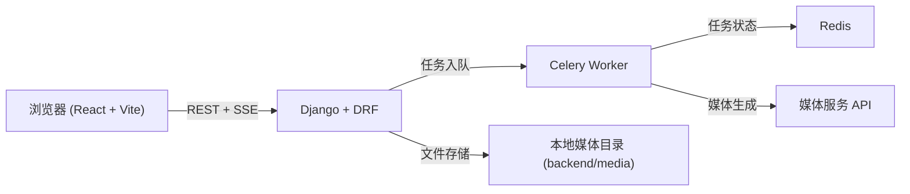

# Canvex

[](https://react.dev/)
[](https://www.djangoproject.com/)
[](https://redis.io/)
[](https://docs.docker.com/compose/)

Canvex 是一个独立的 **Excalidraw + AI** 工作区，支持场景管理、流式聊天、图片编辑和视频生成。

Language: [English](./README.md)

## 目录

- [项目简介](#项目简介)
- [核心能力](#核心能力)
- [架构图](#架构图)
- [快速启动（Docker）](#快速启动docker)
- [本地开发](#本地开发)
- [环境变量](#环境变量)
- [API 概览](#api-概览)
- [SSE 事件格式](#sse-事件格式)
- [最小自测](#最小自测)
- [目录结构](#目录结构)
- [常见问题](#常见问题)
- [GitHub 发布前检查](#github-发布前检查)

## 项目简介

Canvex 是一个基于 Excalidraw 的 AI 工作区，聚焦画布创作、图片编辑、视频生成和素材管理，开箱即用且无需账号登录。

## 核心能力

- Excalidraw 场景 CRUD（新建、重命名、复制、删除）
- AI 聊天（SSE 流式 + 非流式回退）
- 工具回调（生图/生视频）并自动 pin 到画布
- 图片编辑（含抠图）与异步视频轮询
- Data Library 文件夹与素材管理
- Excalidraw 资源本地托管（字体/语言包）

## 架构图



## 快速启动（Docker）

前置要求：
- Docker
- Docker Compose

```bash
cp .env.example .env
docker compose up -d --build
```

默认地址：
- 前端: [http://localhost:5173](http://localhost:5173)
- 后端 API: [http://localhost:28000](http://localhost:28000)

常用命令：

```bash
# 查看日志
docker compose logs -f backend worker frontend

# 停止服务
docker compose down
```

## 本地开发

前端：

```bash
cd frontend
npm install
npm run dev
```

后端：

```bash
cd backend
pip install -r requirements.txt
python manage.py migrate
python manage.py runserver 0.0.0.0:8000
```

Worker：

```bash
cd backend
celery -A config worker -l info -Q excalidraw -n excalidraw@%h -c 2 -Ofair --prefetch-multiplier=1
```

## 环境变量

完整说明见 `.env.example`。

| 分类 | 关键变量 |
| --- | --- |
| 聊天模型 | `OPENAI_API_KEY`, `OPENAI_BASE_URL`, `EXCALIDRAW_CHAT_MODEL` |
| 媒体生成 | `MEDIA_OPENAI_BASE_URL`, `MEDIA_OPENAI_API_KEY`, `MEDIA_OPENAI_IMAGE_MODEL`, `MEDIA_OPENAI_IMAGE_EDIT_MODEL`, `MEDIA_OPENAI_VIDEO_MODEL` |
| 视频轮询 | `MEDIA_OPENAI_VIDEO_TIMEOUT_SECONDS`, `MEDIA_OPENAI_VIDEO_POLL_MAX_ATTEMPTS`, `MEDIA_OPENAI_VIDEO_POLL_INTERVAL` |
| 前端配置 | `VITE_API_URL`, `VITE_EXCALIDRAW_ASSET_PATH`, `VITE_VIDEO_POLL_MAX_ATTEMPTS`, `VITE_VIDEO_POLL_INTERVAL_MS` |
| 容器内媒体回源 | `INTERNAL_MEDIA_BASE`（默认 `http://backend:8000`） |

## API 概览

| 模块 | 接口 |
| --- | --- |
| 场景 | `GET/POST /api/v1/excalidraw/scenes/`，`GET/PATCH/DELETE /api/v1/excalidraw/scenes/{id}/` |
| 聊天 | `GET/POST /api/v1/excalidraw/scenes/{id}/chat/`（`?stream=1` 为 SSE） |
| 图片编辑 | `POST /api/v1/excalidraw/scenes/{id}/image-edit/` |
| 视频生成 | `POST /api/v1/excalidraw/scenes/{id}/video/` |
| 素材库 | `GET/POST /api/v1/library/folders/`、`GET/PATCH/DELETE /api/v1/library/folders/{id}/`、`GET/POST /api/v1/library/assets/`、`GET/PATCH/DELETE /api/v1/library/assets/{id}/` |
| 任务轮询 | `GET /api/v1/excalidraw/image-edit-jobs/{job_id}/`、`GET /api/v1/excalidraw/scenes/{id}/image-edit-jobs/`、`GET /api/v1/excalidraw/video-jobs/{job_id}/`、`GET /api/v1/excalidraw/scenes/{id}/video-jobs/` |

## SSE 事件格式

`/api/v1/excalidraw/scenes/{id}/chat/?stream=1` 返回 `text/event-stream`。

常见 `data:` 载荷：

- `{"intent":"image"|"video"}`
- `{"delta":"..."}`
- `{"tool-result":{...},"tool":"...","result":{...}}`
- `{"message":{...},"done":true}`
- `{"error":"..."}`

## 最小自测

```bash
./scripts/smoke-test.sh
# 或
./scripts/smoke-test.sh http://localhost:28000
```

建议手动检查：

1. 场景 CRUD
2. 流式聊天
3. 生图 + pin
4. 图片编辑/抠图
5. 视频状态流转（排队/运行/成功/失败）
6. Data Library 上传与列表

## 目录结构

```text
.
├─ docker-compose.yml
├─ .env.example
├─ scripts/
│  └─ smoke-test.sh
├─ backend/
│  ├─ config/
│  ├─ studio/
│  ├─ media/
│  └─ requirements.txt
└─ frontend/
   ├─ src/
   ├─ public/excalidraw-assets/
   └─ scripts/sync-excalidraw-assets.mjs
```

## 常见问题

- `process is not defined`
  - 确认前端 `window.process` shim 与 Vite `define.process.env` 配置已生效。
- CORS 预检失败
  - 确认后端允许 `ngrok-skip-browser-warning` 等请求头。
- 媒体生成 4xx/5xx
  - 优先查看 `backend` / `worker` 日志，并检查 provider 密钥与 base URL。

## GitHub 发布前检查

发布到 GitHub 前建议完成：

1. 确认 `.env` 不会被提交，仅保留 `.env.example`。
2. 若密钥曾暴露，先全部轮换。
3. 核对 CORS/域名等公开部署安全配置。
4. 如需开源，补充 `LICENSE` 文件。
5. 可选：在 `docs/` 下补充截图或动图。
