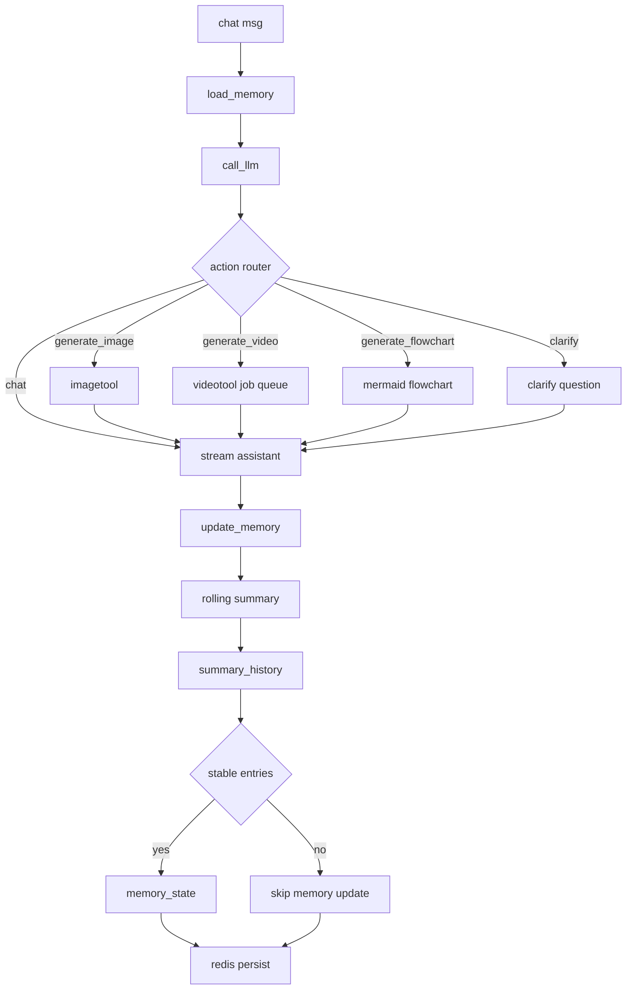

<div align="center">
  <h1>Canvex</h1>
  <p>Canvex是从MeiRed(https://meired.com)独立出来的场景创作功能</p>
  <p>
    <a href="https://react.dev"></a>
    <a href="https://www.djangoproject.com/"></a>
    <a href="https://redis.io/"></a>
  </p>
</div>

主 README: [README.md](./README.md)

## 基本功能

- 画布场景管理：创建、保存、读取场景数据。
- 流程图：支持在画布中快速搭建流程图与结构关系。
- 自由绘画：使用画笔工具进行手绘创作。
- 导入导出功能：支持画布内容导入与导出。
- AI Agent：在场景中通过自然语言驱动编辑流程。
- 图片生成与编辑：支持文生图、图生图、抠图等图片处理能力。
- 视频生成：基于提示词或参考图生成视频并支持任务轮询。
- 文本编辑: 在任意位置添加文本
- 媒体任务管理：统一查询图片/视频任务状态与结果地址。

## AI Agent Graph 架构



- 主干节点固定为：`load_memory -> call_llm -> update_memory`。
- `call_llm` 内先做 action 路由，再决定是普通对话还是触发图片/视频/流程图工具。
- `rolling summary` 每轮更新 `summary_state`，并写入 `summary_history`（滑动窗口）。
- 只有当条目在窗口内达到稳定阈值时，才会提升为长期 `memory_state`，避免把一次性聊天噪声写入记忆。

## 1 分钟启动
### 1) 克隆仓库

```bash
git clone https://github.com/Orieileen/Canvex.git
cd Canvex
```

### 2) 使用 Docker 部署
前置要求：`Docker`、`Docker Compose`

- Docker Desktop 下载：[https://www.docker.com/products/docker-desktop/](https://www.docker.com/products/docker-desktop/)
- Docker Compose 安装说明：[https://docs.docker.com/compose/install/](https://docs.docker.com/compose/install/)

```bash
cp .env.example .env
docker compose up -d --build
```
### 使用前必配环境变量

在`.env`中，通常只要先配下面这些：

| 变量 | 备注 | 示例 |
| --- | --- | --- |
| `OPENAI_API_KEY` | llm agent使用的API Key。 | `sk-xxxx` |
| `OPENAI_BASE_URL` | llm agent接口地址（OpenAI 或兼容网关）。 | `https://api.openai.com/v1` |
| `EXCALIDRAW_CHAT_MODEL` | llm agent使用的模型名。 | `gpt-4o-mini` |
| `MEDIA_OPENAI_API_KEY` | 图片/视频任务使用的 API Key。可与 `OPENAI_API_KEY` 相同。 | `sk-xxxx` |
| `MEDIA_OPENAI_BASE_URL` | 图片/视频任务接口地址（媒体网关）。 | `https://api.openai.com/v1` |
| `MEDIA_OPENAI_IMAGE_EDIT_MODEL` | 图片编辑/抠图流程使用的模型名。 | `gpt-image-1.5` |
| `MEDIA_OPENAI_VIDEO_MODEL` | 视频生成使用的模型名。 | `sora-2` |

说明：

- 你使用第三方兼容网关时，`*_BASE_URL` 和模型名要按该网关支持列表填写。
- 若对话与媒体走同一服务，可让 `OPENAI_*` 和 `MEDIA_OPENAI_*` 使用同一套配置。

启动后访问：

- 前端：[http://localhost:5173](http://localhost:5173)
- 后端 API：[http://localhost:28000](http://localhost:28000)


## 常用 API

- 场景：`/api/v1/excalidraw/scenes/`
- 聊天：`/api/v1/excalidraw/scenes/{id}/chat/`
- 图片编辑：`/api/v1/excalidraw/scenes/{id}/image-edit/`
- 视频生成：`/api/v1/excalidraw/scenes/{id}/video/`
- 任务查询：`/api/v1/excalidraw/image-edit-jobs/{job_id}/`、`/api/v1/excalidraw/video-jobs/{job_id}/`


## 常见问题

- 媒体任务失败：查看日志

```bash
docker compose logs -f backend worker frontend
```

- 图片/视频结果与预期不一致：优先检查模型配置与接口url与 `MEDIA_OPENAI_*` 变量。
- 前端请求报跨域：检查后端 CORS 配置。
