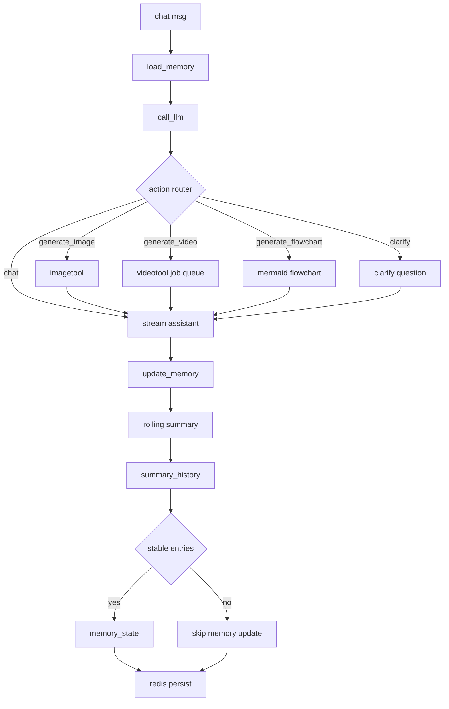

<div align="center">
  <h1>Canvex</h1>
  <p>Canvex是具有场景创作功能的无限画布llm agent</p>
  <p>
    <a href="https://react.dev"></a>
    <a href="https://www.djangoproject.com/"></a>
    <a href="https://www.mysql.com/"></a>
    <a href="https://redis.io/"></a>
  </p>
</div>

主 README: [README.md](./README.md)

## 基本功能

- 画布场景管理：创建、保存、读取场景数据。
- 流程图：支持在画布中快速搭建流程图与结构关系。
- 自由绘画：使用画笔工具进行手绘创作。
- 导入导出功能：支持画布内容导入与导出。
- AI Agent：在场景中通过自然语言驱动编辑流程。
- 图片生成与编辑：支持文生图、图生图、抠图等图片处理能力。
- 视频生成：基于提示词或参考图生成视频并支持任务轮询。
- 文本编辑: 在任意位置添加文本
- 媒体任务管理：统一查询图片/视频任务状态与结果地址。

## AI Agent Graph 架构


```mermaid
flowchart TD
  A["chat msg"] --> B["load_memory"]
  B --> C["call_llm"]
  C --> D{"action router"}
  D -->|chat| E["stream assistant"]
  D -->|generate_image| F["imagetool"]
  D -->|generate_video| G["videotool job queue"]
  D -->|generate_flowchart| H["mermaid flowchart"]
  D -->|clarify| I["clarify question"]
  F --> E
  G --> E
  H --> E
  I --> E
  E --> J["update_memory"]
  J --> K["rolling summary"]
  K --> L["summary_history"]
  L --> M{"stable entries"}
  M -->|yes| N["memory_state"]
  M -->|no| O["skip memory update"]
  N --> P["redis persist"]
  O --> P
```

- 主干节点固定为：`load_memory -> call_llm -> update_memory`。
- `call_llm` 内先做 action 路由，再决定是普通对话还是触发图片/视频/流程图工具。
- `rolling summary` 每轮更新 `summary_state`，并写入 `summary_history`（滑动窗口）。
- 只有当条目在窗口内达到稳定阈值时，才会提升为长期 `memory_state`，避免把一次性聊天噪声写入记忆。

## 1 分钟启动
### 1) 克隆仓库

```bash
git clone https://github.com/Orieileen/Canvex.git
cd Canvex
```

### 2) 使用 Docker 部署
前置要求：`Docker`、`Docker Compose`

- Docker Desktop 下载：[https://www.docker.com/products/docker-desktop/](https://www.docker.com/products/docker-desktop/)
- Docker Compose 安装说明：[https://docs.docker.com/compose/install/](https://docs.docker.com/compose/install/)

```bash
cp .env.example .env
docker compose up -d --build
```
### 使用前必配环境变量

在`.env`中，通常只要先配下面这些：

| 变量 | 备注 | 示例 |
| --- | --- | --- |
| `OPENAI_API_KEY` | llm agent使用的API Key。 | `sk-xxxx` |
| `OPENAI_BASE_URL` | llm agent接口地址（OpenAI 或兼容网关）。 | `https://api.openai.com/v1` |
| `EXCALIDRAW_CHAT_MODEL` | llm agent使用的模型名。 | `gpt-4o-mini` |
| `MEDIA_OPENAI_API_KEY` | 图片/视频任务使用的 API Key。可与 `OPENAI_API_KEY` 相同。 | `sk-xxxx` |
| `MEDIA_OPENAI_BASE_URL` | 图片/视频任务接口地址（媒体网关）。 | `https://api.openai.com/v1` |
| `MEDIA_OPENAI_IMAGE_EDIT_MODEL` | 图片编辑/抠图流程使用的模型名。 | `gpt-image-1.5` |
| `MEDIA_OPENAI_VIDEO_MODEL` | 视频生成使用的模型名。 | `sora-2` |

Docker Compose 默认的数据库变量：

| 变量 | 备注 | 示例 |
| --- | --- | --- |
| `MYSQL_DATABASE` | 业务库名。 | `canvex` |
| `MYSQL_USER` | 业务库用户。 | `canvex` |
| `MYSQL_PASSWORD` | 业务库密码。 | `canvex` |
| `MYSQL_HOST` | MySQL 主机名。Docker Compose 场景保持为 `mysql`。 | `mysql` |
| `MYSQL_PORT` | MySQL 端口。 | `3306` |
| `MYSQL_ROOT_PASSWORD` | 初始化 MySQL 容器时使用的 root 密码。 | `change-me-root-password` |

说明：

- 你使用第三方兼容网关时，`*_BASE_URL` 和模型名要按该网关支持列表填写。
- 若对话与媒体走同一服务，可让 `OPENAI_*` 和 `MEDIA_OPENAI_*` 使用同一套配置。
- 现在执行 `docker compose up -d --build` 会自动启动 MySQL；已有 `db.sqlite3` 数据不会自动迁移进 MySQL。

启动后访问：

- 前端：[http://localhost:5173](http://localhost:5173)
- 后端 API：[http://localhost:28000](http://localhost:28000)


## 常用 API

- 场景：`/api/v1/excalidraw/scenes/`
- 聊天：`/api/v1/excalidraw/scenes/{id}/chat/`
- 图片编辑：`/api/v1/excalidraw/scenes/{id}/image-edit/`
- 视频生成：`/api/v1/excalidraw/scenes/{id}/video/`
- 任务查询：`/api/v1/excalidraw/image-edit-jobs/{job_id}/`、`/api/v1/excalidraw/video-jobs/{job_id}/`


## 前端架构

技术栈：React 18 + TypeScript + Vite + Tailwind CSS + shadcn/ui + react-i18next + Excalidraw。

### 核心页面模块划分

画布主页面 `canvex.tsx` 拆分为类型、常量、工具函数、样式和 8 个自定义 Hook，主组件仅作为编排层。

```
frontend/src/
├── types/canvex.ts                    # 共享 TypeScript 类型（SceneData, SceneRecord, ChatMessage 等）
├── constants/canvex.ts                # API 常量、防抖时间、尺寸选项
├── utils/canvex.ts                    # 纯函数（toSceneSummary, sanitizeAppState, normalizeMermaid 等）
├── styles/canvex-media-sidebar.css    # 媒体库侧边栏样式
├── hooks/
│   ├── use-canvex-theme.ts            # 画布主题解析、视频封面生成、视频元素判断
│   ├── use-canvas-elements.ts         # 元素创建（文本/矩形/图片）、选区计算、坐标转换
│   ├── use-scene-persistence.ts       # localStorage 缓存、场景 CRUD、保存防抖、URL 同步
│   ├── use-pinning.ts                 # 钉选笔记、占位符管理、闪烁动画、Mermaid 流程图插入
│   ├── use-media-library.ts           # 媒体库加载、项目文件夹分组、图片/视频插入
│   ├── use-image-edit-pipeline.ts     # 图片编辑工具栏、任务轮询、结果插入、编辑恢复
│   ├── use-video-pipeline.ts          # 视频生成、任务轮询、Overlay 刷新、状态追踪
│   └── use-chat.ts                    # SSE 流式聊天、消息持久化、工具调用分发
└── pages/dashboard/canvex.tsx         # 编排层：初始化 Hook、组装回调、渲染 JSX
```

### Hook 初始化顺序

```
theme → canvasElements → scenePersistence → pinning → mediaLibrary
      → imageEditPipeline → videoPipeline → chat
```

后续 Hook 可依赖前序 Hook 的返回值；跨 Hook 的循环依赖通过 `useRef` 间接引用打断：

| Ref | 写入方 | 读取方 |
|-----|--------|--------|
| `captureSceneSnapshotRef` | 主组件（所有 Hook 初始化后赋值） | pinning, imageEdit, video |
| `scheduleVideoOverlayRefreshRef` | 主组件（videoPipeline 初始化后赋值） | imageEdit |
| `createPinnedImageRef` | imageEditPipeline（useEffect 赋值） | chat, mediaLibrary |
| `createPinnedVideoRef` | videoPipeline（useEffect 赋值） | chat, mediaLibrary |

### 共享状态方案

不使用 React Context。原因：

1. 共享数据大部分是 `useRef`（不触发渲染），Context 没有意义。
2. 参数传递让每个 Hook 的依赖关系显式可见。
3. 与现有 `createPinnedImageRef` / `createPinnedVideoRef` 的间接引用模式一致。

主组件声明约 30 个 `useRef`，按需传给各 Hook。

### 回调稳定性

为防止无限重渲染，关键模式：

- `searchParams`（每次渲染都是新对象）存入 `searchParamsRef`，`updateSceneParam` 只读 ref。
- `selectScene` 使用 `sceneIdRef.current` 而非 `activeSceneId` 状态，避免自身 setState 导致回调重建。
- `updateSelectedEditSelection` 内部通过 ref 读取 `selectedEditKey` / `selectedEditRect`，不放入 `useCallback` 依赖。
- `captureSceneSnapshot` 和 `scheduleVideoOverlayRefresh` 通过 `useCallback(() => ref.current(), [])` 包装为稳定引用，再传给各 Hook。

## 常见问题

- 媒体任务失败：查看日志

```bash
docker compose logs -f backend worker frontend
```

- 图片/视频结果与预期不一致：优先检查模型配置与接口url与 `MEDIA_OPENAI_*` 变量。
- 前端请求报跨域：检查后端 CORS 配置。
