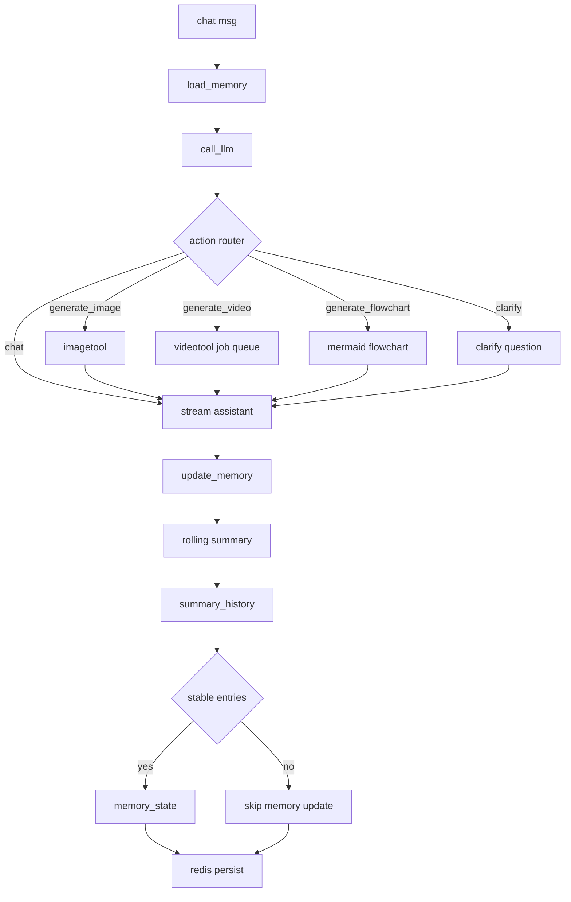

<div align="center">
  <h1>Canvex</h1>
  <p>Canvex是具有场景创作功能的无限画布llm agent</p>
  <p>
    <a href="https://react.dev"></a>
    <a href="https://www.djangoproject.com/"></a>
    <a href="https://www.mysql.com/"></a>
    <a href="https://redis.io/"></a>
  </p>
</div>

主 README: [README.md](./README.md)

## 基本功能

- 画布场景管理：创建、保存、读取场景数据。
- 流程图：支持在画布中快速搭建流程图与结构关系。
- 自由绘画：使用画笔工具进行手绘创作。
- 导入导出功能：支持画布内容导入与导出。
- AI Agent：在场景中通过自然语言驱动编辑流程。
- 图片生成与编辑：支持文生图、图生图、抠图等图片处理能力。
- 视频生成：基于提示词或参考图生成视频并支持任务轮询。
- 文本编辑: 在任意位置添加文本
- 媒体任务管理：统一查询图片/视频任务状态与结果地址。

## AI Agent Graph 架构


```mermaid
flowchart TD
  A["chat msg"] --> B["load_memory"]
  B --> C["call_llm"]
  C --> D{"action router"}
  D -->|chat| E["stream assistant"]
  D -->|generate_image| F["imagetool"]
  D -->|generate_video| G["videotool job queue"]
  D -->|generate_flowchart| H["mermaid flowchart"]
  D -->|clarify| I["clarify question"]
  F --> E
  G --> E
  H --> E
  I --> E
  E --> J["update_memory"]
  J --> K["rolling summary"]
  K --> L["summary_history"]
  L --> M{"stable entries"}
  M -->|yes| N["memory_state"]
  M -->|no| O["skip memory update"]
  N --> P["redis persist"]
  O --> P
```

- 主干节点固定为：`load_memory -> call_llm -> update_memory`。
- `call_llm` 内先做 action 路由，再决定是普通对话还是触发图片/视频/流程图工具。
- `rolling summary` 每轮更新 `summary_state`，并写入 `summary_history`（滑动窗口）。
- 只有当条目在窗口内达到稳定阈值时，才会提升为长期 `memory_state`，避免把一次性聊天噪声写入记忆。

## 1 分钟启动
### 1) 克隆仓库

```bash
git clone https://github.com/Orieileen/Canvex.git
cd Canvex
```

### 2) 使用 Docker 部署
前置要求：`Docker`、`Docker Compose`

- Docker Desktop 下载：[https://www.docker.com/products/docker-desktop/](https://www.docker.com/products/docker-desktop/)
- Docker Compose 安装说明：[https://docs.docker.com/compose/install/](https://docs.docker.com/compose/install/)

```bash
cp .env.example .env
docker compose up -d --build
```
### 使用前必配环境变量

在 `.env` 中，最少只需配置以下变量即可启动：

| 变量 | 备注 | 示例 |
| --- | --- | --- |
| `OPENAI_API_KEY` | 聊天 LLM 的 API Key | `sk-xxxx` |
| `OPENAI_BASE_URL` | 聊天 LLM 接口地址（OpenAI 或兼容网关） | `https://api.openai.com/v1` |
| `CHAT_MODEL` | 聊天模型名 | `gpt-4o-mini` |
| `MEDIA_API_KEY` | 图片/视频任务 API Key（可与 `OPENAI_API_KEY` 相同） | `sk-xxxx` |
| `MEDIA_BASE_URL` | 图片/视频任务接口地址 | `https://api.openai.com/v1` |
| `MEDIA_IMAGE_MODEL` | 生图模型 | `gpt-image-1.5` |
| `MEDIA_IMAGE_EDIT_MODEL` | 图片编辑模型 | `gpt-image-1.5` |
| `MEDIA_VIDEO_MODEL` | 视频生成模型 | `sora-2` |

### 第三方供应商兼容配置

图片和视频均支持两条调用路径：**OpenAI SDK**（默认）和 **Compat 兼容端点**（配置 `*_COMPAT_ENDPOINT` 后启用）。兼容端点通过环境变量自由搭配字段名和请求格式，适配任意第三方供应商。

#### 图片 — 生图 & 编辑

| 变量 | 说明 | 默认值 |
| --- | --- | --- |
| `MEDIA_IMAGE_COMPAT_ENDPOINT` | 生图兼容端点路径（拼接到 `MEDIA_BASE_URL` 后） | 不设 = 走 OpenAI SDK |
| `MEDIA_IMAGE_COMPAT_SIZE_FIELD` | 生图尺寸字段名 | `size` |
| `MEDIA_IMAGE_EDIT_COMPAT_ENDPOINT` | 图片编辑兼容端点路径 | 不设 = 走 OpenAI SDK |
| `MEDIA_IMAGE_EDIT_COMPAT_IMAGE_FIELD` | 编辑时原图字段名（含 `urls` 则包装为数组） | `image_urls` |
| `MEDIA_IMAGE_EDIT_COMPAT_SIZE_FIELD` | 编辑时尺寸字段名 | `size` |
| `MEDIA_IMAGE_COMPAT_POLL_ENDPOINT` | 异步供应商轮询路径 | 与创建端点相同 |
| `MEDIA_IMAGE_POLL_INTERVAL` | 轮询间隔（秒） | `3` |
| `MEDIA_IMAGE_POLL_MAX_ATTEMPTS` | 最大轮询次数 | `200` |

#### 视频

| 变量 | 说明 | 默认值 |
| --- | --- | --- |
| `MEDIA_VIDEO_COMPAT_ENDPOINT` | 兼容端点路径 | 不设 = 走 OpenAI SDK |
| `MEDIA_VIDEO_COMPAT_CONTENT_TYPE` | 请求格式：`json` 或 `multipart` | `json` |
| `MEDIA_VIDEO_COMPAT_DURATION_FIELD` | 时长字段名 | `duration` |
| `MEDIA_VIDEO_COMPAT_SIZE_FIELD` | 尺寸字段名（`aspect_ratio` 发 `"16:9"`，`size` 发 `"1280x720"`） | `aspect_ratio` |
| `MEDIA_VIDEO_COMPAT_IMAGE_FIELD` | 图片引用字段名 | `image` |
| `MEDIA_VIDEO_POLL_INTERVAL` | 轮询间隔（秒） | `5` |
| `MEDIA_VIDEO_POLL_MAX_ATTEMPTS` | 最大轮询次数 | `360` |

#### 配置示例

<details>
<summary>OpenAI 直连（默认，不需要额外配置）</summary>

```env
MEDIA_BASE_URL=https://api.openai.com/v1
MEDIA_IMAGE_MODEL=gpt-image-1.5
MEDIA_VIDEO_MODEL=sora-2
```

</details>

<details>
<summary>第三方供应商 A — JSON 异步</summary>

```env
MEDIA_BASE_URL=https://your-provider-a.com/v1

# 生图
MEDIA_IMAGE_MODEL=your-image-model
MEDIA_IMAGE_COMPAT_ENDPOINT=/images/generations
MEDIA_IMAGE_COMPAT_POLL_ENDPOINT=/tasks

# 图片编辑（使用同一端点 + image_urls 传原图）
MEDIA_IMAGE_EDIT_MODEL=your-image-model
MEDIA_IMAGE_EDIT_COMPAT_ENDPOINT=/images/generations
MEDIA_IMAGE_EDIT_COMPAT_IMAGE_FIELD=image_urls

# 视频
MEDIA_VIDEO_MODEL=sora-2
MEDIA_VIDEO_COMPAT_ENDPOINT=/videos/generations
MEDIA_VIDEO_COMPAT_CONTENT_TYPE=json
MEDIA_VIDEO_COMPAT_DURATION_FIELD=duration
MEDIA_VIDEO_COMPAT_SIZE_FIELD=aspect_ratio
```

</details>

<details>
<summary>第三方供应商 B — multipart</summary>

```env
MEDIA_BASE_URL=https://your-provider-b.com/v1

# 视频
MEDIA_VIDEO_MODEL=sora-2
MEDIA_VIDEO_COMPAT_ENDPOINT=/videos
MEDIA_VIDEO_COMPAT_CONTENT_TYPE=multipart
MEDIA_VIDEO_COMPAT_DURATION_FIELD=seconds
MEDIA_VIDEO_COMPAT_SIZE_FIELD=size
MEDIA_VIDEO_COMPAT_IMAGE_FIELD=input_reference
```

</details>

### 数据库

Docker Compose 默认的数据库变量：

| 变量 | 备注 | 示例 |
| --- | --- | --- |
| `MYSQL_DATABASE` | 业务库名 | `canvex` |
| `MYSQL_USER` | 业务库用户 | `canvex` |
| `MYSQL_PASSWORD` | 业务库密码 | `canvex` |
| `MYSQL_HOST` | MySQL 主机名（Docker Compose 场景保持为 `mysql`） | `mysql` |
| `MYSQL_PORT` | MySQL 端口 | `3306` |
| `MYSQL_ROOT_PASSWORD` | 初始化 MySQL 容器时使用的 root 密码 | `change-me-root-password` |

说明：

- 使用第三方兼容网关时，`*_BASE_URL` 和模型名按该网关文档填写。
- 若对话与媒体走同一服务，可让 `OPENAI_*` 和 `MEDIA_*` 使用同一套配置。
- `docker compose up -d --build` 会自动启动 MySQL；已有 `db.sqlite3` 数据不会自动迁移进 MySQL。
- 完整环境变量参考见 [.env.example](./.env.example)。

启动后访问：

- 前端：[http://localhost:5173](http://localhost:5173)
- 后端 API：[http://localhost:28000](http://localhost:28000)


## 常用 API

- 场景：`/api/v1/excalidraw/scenes/`
- 聊天：`/api/v1/excalidraw/scenes/{id}/chat/`
- 图片编辑：`/api/v1/excalidraw/scenes/{id}/image-edit/`
- 视频生成：`/api/v1/excalidraw/scenes/{id}/video/`
- 任务查询：`/api/v1/excalidraw/image-edit-jobs/{job_id}/`、`/api/v1/excalidraw/video-jobs/{job_id}/`


## 后端架构

技术栈：Django + DRF + Celery + Redis + MySQL + LangGraph。

### 目录结构

```
backend/
├── config/                # Django 配置
│   ├── settings.py        # 全局设置、数据库、CORS、Celery
│   ├── celery.py          # Celery 应用初始化
│   └── urls.py            # 根路由
└── studio/                # 主应用
    ├── models.py           # 数据模型（Scene, Job, Asset, Folder）
    ├── views.py            # API 端点（Chat, ImageEdit, Video）
    ├── serializers.py      # DRF 序列化
    ├── urls.py             # 应用路由
    ├── graphs.py           # AI Agent Graph（LangGraph 编排）
    ├── memory.py           # Redis 记忆系统（summary + memory）
    ├── tasks.py            # Celery 异步任务（图片编辑、视频生成）
    ├── video_script.py     # 视频分镜脚本分析
    └── tools/              # 媒体生成工具
        ├── image.py        # 图片生成 & 编辑（OpenAI SDK / Compat）
        ├── video.py        # 视频生成（OpenAI SDK / Compat）
        ├── assets.py       # 资产存储 & 文件夹管理
        └── common.py       # 共享工具（URL 解析、图片下载、OpenAI client）
```

### 媒体生成双路径架构

图片和视频均支持两条执行路径，由 `*_COMPAT_ENDPOINT` 环境变量切换：

| 功能 | OpenAI SDK（默认） | Compat 兼容端点 |
|---|---|---|
| 生图 | Responses API + `image_generation` | POST JSON → 同步提取或异步轮询 |
| 图片编辑 | Responses API + `image_generation(edit)` | POST JSON（含原图 data URL）→ 同步/异步 |
| 视频 | `client.videos.create` → 轮询 → 下载 | POST JSON 或 multipart → 轮询 → 下载 |

Compat 路径的字段名（尺寸、时长、图片引用）、请求格式（JSON/multipart）均通过环境变量配置，详见 [.env.example](./.env.example)。

### 图片生成 & 编辑流程

```
POST /api/v1/excalidraw/scenes/{id}/image-edit/
  → 创建 ExcalidrawImageEditJob（status=QUEUED）
  → Celery: run_excalidraw_image_edit_job
    → _edit_image_media(source_bytes, prompt, size)
      ├─ COMPAT_ENDPOINT 有值 → _post_compat_image_request()
      │   ├─ 响应含图片数据 → 同步提取 bytes
      │   └─ 响应含 task_id  → 异步轮询 → 下载图片
      └─ 未设置 → Responses API（image_generation action=edit）
    → [is_cutout? → rembg 去白底]
    → _save_asset() → ExcalidrawImageEditResult
```

AI 聊天中的生图走 `graphs.py → imagetool → _generate_image_media()`，流程类似但不经过 Job 队列。

### 视频生成流程

```
POST /api/v1/excalidraw/scenes/{id}/video/
  → 创建 ExcalidrawVideoJob（status=QUEUED）
  → Celery: run_excalidraw_video_job
    → _generate_video_media(payload)
      ├─ COMPAT_ENDPOINT 有值 → JSON 或 multipart → 轮询 → 下载
      └─ 未设置 → OpenAI Videos API → 轮询 → 下载
    → 保存缩略图 → 更新 job（status, result_url, thumbnail_url）
    → 失败时指数退避重试（最多 6 次，20s ~ 180s）
```

前端通过轮询 `/api/v1/excalidraw/video-jobs/{job_id}/` 获取任务状态和结果 URL。

### SSE 流式响应

聊天端点 `?stream=1` 返回 SSE 事件流：

```
data: {"intent": "image"}          ← 通知前端正在生成图片/视频
data: {"tool": "imagetool", "result": {...}}  ← 工具执行结果
data: {"delta": "文本片段"}         ← 流式文本
data: {"done": true, "message": {...}}        ← 完成
```

### 记忆系统

Redis 存储两层状态（per workspace + scene）：

- **summary_state** — 当前对话摘要（goal、constraints、decisions、open_questions、next_actions）
- **memory_state** — 长期记忆（preferences、policies、constraints）

每轮对话后更新 summary；条目在滑动窗口内出现 ≥ `MEMORY_STABILITY_MIN_COUNT` 次才提升为长期 memory，避免噪声写入。

### Celery 任务

| 任务 | 触发方式 | 重试 |
|---|---|---|
| `run_excalidraw_image_edit_job` | 图片编辑 POST | 不重试 |
| `run_excalidraw_video_job` | 视频生成 POST / AI 聊天 | 指数退避，最多 6 次 |

## 前端架构

技术栈：React 18 + TypeScript + Vite + Tailwind CSS + shadcn/ui + react-i18next + Excalidraw。

### 核心页面模块划分

画布主页面 `canvex.tsx` 拆分为类型、常量、工具函数、样式和 8 个自定义 Hook，主组件仅作为编排层。

```
frontend/src/
├── types/canvex.ts                    # 共享 TypeScript 类型（SceneData, SceneRecord, ChatMessage 等）
├── constants/canvex.ts                # API 常量、防抖时间、尺寸选项
├── utils/canvex.ts                    # 纯函数（toSceneSummary, sanitizeAppState, normalizeMermaid 等）
├── styles/canvex-media-sidebar.css    # 媒体库侧边栏样式
├── hooks/
│   ├── use-canvex-theme.ts            # 画布主题解析、视频封面生成、视频元素判断
│   ├── use-canvas-elements.ts         # 元素创建（文本/矩形/图片）、选区计算、坐标转换
│   ├── use-scene-persistence.ts       # localStorage 缓存、场景 CRUD、保存防抖、URL 同步
│   ├── use-pinning.ts                 # 钉选笔记、占位符管理、闪烁动画、Mermaid 流程图插入
│   ├── use-media-library.ts           # 媒体库加载、项目文件夹分组、图片/视频插入
│   ├── use-image-edit-pipeline.ts     # 图片编辑工具栏、任务轮询、结果插入、编辑恢复
│   ├── use-video-pipeline.ts          # 视频生成、任务轮询、Overlay 刷新、状态追踪
│   └── use-chat.ts                    # SSE 流式聊天、消息持久化、工具调用分发
└── pages/dashboard/canvex.tsx         # 编排层：初始化 Hook、组装回调、渲染 JSX
```

### Hook 初始化顺序

```
theme → canvasElements → scenePersistence → pinning → mediaLibrary
      → imageEditPipeline → videoPipeline → chat
```

后续 Hook 可依赖前序 Hook 的返回值；跨 Hook 的循环依赖通过 `useRef` 间接引用打断：

| Ref | 写入方 | 读取方 |
|-----|--------|--------|
| `captureSceneSnapshotRef` | 主组件（所有 Hook 初始化后赋值） | pinning, imageEdit, video |
| `scheduleVideoOverlayRefreshRef` | 主组件（videoPipeline 初始化后赋值） | imageEdit |
| `createPinnedImageRef` | imageEditPipeline（useEffect 赋值） | chat, mediaLibrary |
| `createPinnedVideoRef` | videoPipeline（useEffect 赋值） | chat, mediaLibrary |

### 共享状态方案

不使用 React Context。原因：

1. 共享数据大部分是 `useRef`（不触发渲染），Context 没有意义。
2. 参数传递让每个 Hook 的依赖关系显式可见。
3. 与现有 `createPinnedImageRef` / `createPinnedVideoRef` 的间接引用模式一致。

主组件声明约 30 个 `useRef`，按需传给各 Hook。

### 回调稳定性

为防止无限重渲染，关键模式：

- `searchParams`（每次渲染都是新对象）存入 `searchParamsRef`，`updateSceneParam` 只读 ref。
- `selectScene` 使用 `sceneIdRef.current` 而非 `activeSceneId` 状态，避免自身 setState 导致回调重建。
- `updateSelectedEditSelection` 内部通过 ref 读取 `selectedEditKey` / `selectedEditRect`，不放入 `useCallback` 依赖。
- `captureSceneSnapshot` 和 `scheduleVideoOverlayRefresh` 通过 `useCallback(() => ref.current(), [])` 包装为稳定引用，再传给各 Hook。

## 常见问题

- 媒体任务失败：查看日志

```bash
docker compose logs -f backend worker frontend
```

- 图片/视频结果与预期不一致：优先检查模型配置与接口url与 `MEDIA_*` 变量。
- 前端请求报跨域：检查后端 CORS 配置。
