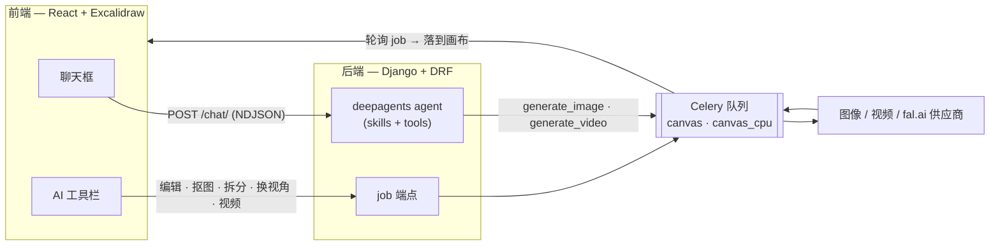

<div align="center">
  <h1>Canvex</h1>
  <p>Canvex 是一个具有对话、skills、生成和编辑图像和视频能力的无限画布 LLM Agent。通过场景管理，可以将多个画布用于不同的项目。</p>
  <p>
    <a href="https://react.dev"></a>
    <a href="https://www.djangoproject.com/"></a>
    <a href="https://www.postgresql.org/"></a>
    <a href="https://redis.io/"></a>
    <a href="https://github.com/langchain-ai/deepagents"></a>
  </p>
</div>

Main README: [English](./README.md)

## 功能

- **聊天即创作** —— 在画布底部聊天框输入提示词，agent 生成一张或多张图片（或一段视频）并落到画布上。
- **任意图片上的 AI 工具栏** —— 选中图片即弹出浮动工具栏：
  - **编辑** —— 用提示词改风格/改内容。
  - **抠图** —— 一键去背景成透明主体。
  - **拆分** —— 从一张图产出上下两张：透明主体 + 去掉主体的干净背景。
  - **换视角** —— 拖一个 3D 立方体，从新机位重渲染（fal.ai LoRA）。
  - **视频** —— 把静图变成一段动画。
  - **样机** —— 借深度把一张设计图贴到另一张图上，带 深度 / 蒙版 / 不透明度 控制。
  - **合并 / 调整 / 下载 / 发到聊天** —— 本地拍平选区、Lightroom 风格调色面板、导出画布、或把图作为LLM Agent参考附件。
- **框 & 箭头标注** —— 精细化编辑图片：在图上画框/箭头/文字来指向要改的区域。
- **Skills（技能）** —— agent 遵循的内置 playbook（如 `image-prompt-sop` 把模糊需求改写成高质量单图提示词、`amazon-listing-pack-sop` 一键生成协调的 7 张亚马逊套图）。可在聊天框按单条消息临时关掉某个技能。用户可自定义增加或删除Skills。
- **场景** —— 侧栏里多个独立画布：新建、重命名、删除、**置顶**、快速切换；编辑自动保存。
- **素材库** —— 保存你生成过的所有图片/视频，按画布分组；点缩略图即可重新插回当前画布。
- **分辨率档位** —— 图像生成/编辑支持 1K / 2K / 4K（需供应商以及模型支持）。

## 架构概览


```mermaid
flowchart LR
  subgraph FE["前端 — React + Excalidraw"]
    Chat["聊天框"]
    Bar["AI 工具栏"]
  end
  subgraph BE["后端 — Django + DRF"]
    Agent["deepagents agent<br/>(skills + tools)"]
    API["job 端点"]
  end
  Q[["Celery 队列<br/>canvas · canvas_cpu"]]
  Prov["图像 / 视频 / fal.ai 供应商"]

  Chat -->|"POST /chat/ (NDJSON)"| Agent
  Agent -->|"generate_image · generate_video"| Q
  Bar -->|"编辑 · 抠图 · 拆分 · 换视角 · 视频"| API --> Q
  Q --> Prov --> Q
  Q -->|"轮询 job → 落到画布"| FE
```

- 聊天 agent 是 **deepagents**（`create_deep_agent`），带两个工具（`generate_image`、`generate_video`）、一份按场景隔离的 memory 文件、以及按需展开的 **SKILL.md** 技能。每轮对话历史从数据库回放（不需要独立的记忆存储）。
- 每次生成都是异步 **job**：API 建一条 `QUEUED` 记录、提交后入 Celery 队列；前端轮询 job 直到结果就绪再落到画布。抠图是两段链（LLM 出白底 → CPU rembg 出 alpha）。

## 部署

### 1）克隆

```bash
git clone https://github.com/Orieileen/Canvex.git
cd Canvex
```

### 2）配置

```bash
cp .env.example .env
```

至少配好聊天和图像供应商的 key（见下表）。[.env.example](./.env.example) 是完整带注释的参考 —— 含可选的备用供应商、异步轮询、字段映射等旋钮。

### 3）启动（Docker）

前置：Docker + Docker Compose。

- Docker Desktop：[https://www.docker.com/products/docker-desktop/](https://www.docker.com/products/docker-desktop/)
- Docker Compose 安装文档：[https://docs.docker.com/compose/install/](https://docs.docker.com/compose/install/)

```bash
docker compose up -d --build
```

会启动 Postgres、Redis、后端（启动时自动跑迁移）、三个 Celery worker、以及前端 dev server。

- 前端：http://localhost:5173
- 后端 API：http://localhost:28000

## 环境变量

最少需要这些就能跑起来（完整列表 + 调优旋钮见 [.env.example](./.env.example)）：

| 变量 | 必填 | 说明 |
| --- | --- | --- |
| `CANVAS_CHAT_API_KEY` | ✅ 聊天 | agent 用的 LLM key，需支持 OpenAI 风格的 tool calling。**不会**回退到 `OPENAI_*`。 |
| `CANVAS_CHAT_BASE_URL` | – | 聊天端点；留空 = OpenAI 默认。 |
| `CANVAS_CHAT_MODEL` | – | 默认 `gpt-4o-mini`。 |
| `CANVAS_VIDEO_API_KEY` / `_BASE_URL` / `_MODEL` | ✅ 视频 | 用视频功能必填（OpenAI 兼容 `POST {base}/videos/generations` + 轮询）。 |
| `PUBLIC_MEDIA_BASE` | ⚠️ | 本后端的公网地址（默认 `http://localhost:28000`）。图生图/视频/换视角时供应商要来拉源图，必须可公网访问 —— 生产用隧道/CDN。纯文生图不需要。 |
| `CANVAS_AGENT_STORE_BACKEND` | – | `memory`（默认，进程内）或 `postgres`（持久化 agent 记忆）。 |
| `POSTGRES_DB` / `_USER` / `_PASSWORD` | – | 默认都是 `canvex`。 |
| `BACKEND_PORT` / `FRONTEND_PORT` | – | 宿主端口，默认 `28000` / `5173`。 |
| `VITE_API_URL` | – | 前端调用的后端地址；默认 `http://localhost:28000`。 |

说明：

- **生图和换视角不在这里配** —— 端点、API key、模型名、按供应商的请求参数全部在界面上填：左侧栏「配置供应商」。可以配多个供应商、多个模型，生成时在工具栏切换。
- **换视角**（多视角）功能跑在 [fal.ai](https://fal.ai) 上：去 fal.ai 注册账号、创建 API key，在同一个面板里加一条 Angle 通道即可。其它功能不需要 fal.ai 账号。
- 从旧版本升级：原有的 `CANVAS_IMAGE_PRIMARY_*` / `CANVAS_IMAGE_FALLBACK_*` / `CANVAS_ANGLE_FAL_*` 会被迁移 `0008` / `0010` 自动导进库，导完就不再读取，可以从 `.env` 里删掉。
- 聊天与视频可共用一个供应商（设置对应的 `*_BASE_URL` 和 key）。
- 产品免费、单工作区：没有鉴权，计费是空操作桩（`CANVAS_CREDIT_COST_*` 不起作用）。

## API

所有路由在 `/api/v1/canvas/` 下。

| 用途 | 端点 |
| --- | --- |
| 场景（CRUD） | `GET/POST /scenes/`、`GET/PATCH/DELETE /scenes/{id}/` |
| 聊天（NDJSON 流） | `POST /scenes/{id}/chat/` |
| 图像编辑 / 生成 | `POST /scenes/{id}/image-edit/` → `GET /image-edit-jobs/{job_id}/` |
| 拆分（主体 + 背景） | `POST /scenes/{id}/split/` |
| 视频 | `POST /scenes/{id}/video/` → `GET /video-jobs/{job_id}/` |
| 换视角（fal.ai） | `POST /scenes/{id}/angle/` → `GET /angle-jobs/{job_id}/` |
| 进行中的 job（恢复轮询） | `GET /scenes/{id}/active-jobs/` |
| 发到聊天的上传 | `POST /scenes/{id}/upload-attachment/` |
| 素材库 | `GET /media-library/folders/`、`GET /media-library/folders/{scene_id}/items/` |
| Skills | `GET /skills/` |

聊天端点走 **NDJSON**（一行一个 JSON；事件类型：`user_created`、`tool_call`、`tool_result`、`assistant_final`、`assistant`、`error`、`done`），不是 SSE。

## 后端

技术栈：**Django + DRF + Celery + Redis + PostgreSQL + deepagents**（底层是 LangChain / LangGraph）。

```
backend/
├── config/                      # Django 工程 (settings, celery, urls, wsgi/asgi)
└── studio/                      # 主 app，挂在 /api/v1/canvas/
    ├── models.py                # Scene, ChatMessage, ImageEditJob/Result,
    │                            #   VideoJob, AngleJob/Result, DataFolder/DataAsset
    ├── views.py  serializers.py  urls.py
    ├── tasks.py                 # Celery: canvas.image_edit_job / image_edit_cutout_job
    │                            #   / video_job / angle_job / cutout_llm_step
    └── services/
        ├── image.py video.py angle.py        # 建 job + 调供应商
        ├── image_client.py                   # OpenAI 兼容图像客户端（按前缀可配）
        ├── attachments.py scenes.py billing.py (空操作) http_retry.py listings_utils.py
        └── agent/
            ├── builder.py        # create_deep_agent (model, tools, skills, memory, store)
            ├── skills.py  context.py
            ├── tools/            # common.py, image.py (generate_image), video.py (generate_video)
            └── skills/           # image-prompt-sop/SKILL.md, amazon-listing-pack-sop/SKILL.md
```

### 异步 job 流水线

一个生成请求会在事务里建 `QUEUED` job、提交后入 Celery 队列（返回 `202` + `{job_id, status}`）。任务跑在专用队列上：

| 队列（worker） | 池 | 任务 |
| --- | --- | --- |
| `canvas`（`worker_canvas`） | gevent | `image_edit_job`、`video_job`、`angle_job`、`cutout_llm_step` |
| `canvas_cpu`（`worker_canvas_cpu`） | prefork | `image_edit_cutout_job`（rembg alpha，CPU 密集） |
| `excalidraw`（`worker`） | prefork | 默认队列 |

抠图/拆分是两段链：第一段（LLM，跑 `canvas`）出白底图，第二段（rembg，跑 `canvas_cpu`）把白底转透明 alpha。前端轮询 job 端点（或 `/active-jobs/`），就绪后落到画布。聊天 agent 调用的图像/视频工具建的是同样的 job —— agent 返回一句"已入队"，不阻塞等渲染。

## FAQ

- **查日志**（某个 job 失败时）—— 要带上三个 worker：

  ```bash
  docker compose logs -f backend worker worker_canvas worker_canvas_cpu
  ```

- **图像结果不对或报错** —— 在侧栏「配置供应商」里核对 base URL、key 和模型名，那个面板带测试按钮。视频则核对 `CANVAS_VIDEO_*` 的 env。
- **图生图/视频/换视角一直不返回** —— 供应商要能拉到你的源图；把 `PUBLIC_MEDIA_BASE` 设成可公网访问的地址。
- **前端请求被 CORS 拦** —— 保持 `CORS_ALLOW_ALL_ORIGINS=true`（默认），或把你的来源加进 `CORS_ALLOWED_ORIGINS`。
