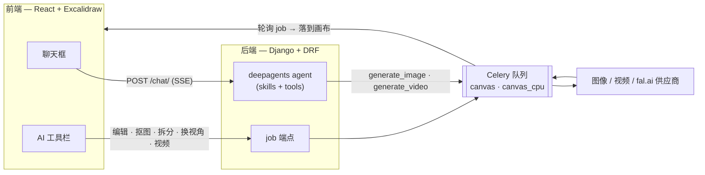

<div align="center">
  <h1>Canvex</h1>
  <p>Canvex 是一个具有对话、skills、生成和编辑图像和视频能力的无限画布 LLM Agent。通过场景管理，可以将多个画布用于不同的项目。</p>
  <p>
    <a href="https://react.dev"></a>
    <a href="https://www.djangoproject.com/"></a>
    <a href="https://www.postgresql.org/"></a>
    <a href="https://redis.io/"></a>
    <a href="https://github.com/langchain-ai/deepagents"></a>
  </p>
</div>

语言：[English](./README.md)

## 功能

- **聊天即创作** —— 在画布底部聊天框输入提示词，agent 生成一张或多张图片（或一段视频）并落到画布上。对话记录本身就是画布上的一个框，能像别的元素一样拖动、缩放、滚动。
- **任意图片上的 AI 工具栏** —— 选中图片即弹出浮动工具栏：
  - **编辑** —— 用提示词改风格/改内容。
  - **抠图** —— 一键去背景成透明主体。
  - **拆分** —— 从一张图产出上下两张：透明主体 + 去掉主体的干净背景。
  - **换视角** —— 拖一个 3D 立方体，从新机位重渲染（fal.ai LoRA）。
  - **视频** —— 把静图变成一段动画。时长、比例、画质三个旋钮**全部按你选的模型来**，不是画布写死的一张表：veo3 只出 8 秒，sora-2 是 4/8/12/16/20，七个模型不收 1:1，还有十个根本没有比例这个入参 —— 那几个下拉直接不出现。
  - **样机** —— 借深度把一张设计图贴到另一张图上，带 深度 / 蒙版 / 不透明度 控制。
  - **合并 / 调整 / 下载 / 发到聊天** —— 本地拍平选区、Lightroom 风格调色面板、导出画布、或把图作为LLM Agent参考附件。
- **多图合成** —— 一次框选最多 8 张图，「图像」页签会变成「合成 N 张图…」，这些图会一起发给供应商。其余工具是单图操作，多选时置灰。
- **框 & 箭头标注** —— 精细化编辑图片：在图上画框/箭头/文字来指向要改的区域。
- **Skills（技能）** —— agent 自己判断该不该用的 playbook（如 `image-prompt-sop` 把模糊需求改写成高质量单图提示词、`amazon-listing-pack-sop` 一键生成协调的 7 张亚马逊套图）。侧栏「技能库」可以装自己的：拖一个 `SKILL.md` 进去（或者直接在浏览器里写），下一条消息 agent 就会用上，**不用重启**。停用和删除也在那里；聊天框里那个是按单条消息临时跳过。
- **场景** —— 侧栏里多个独立画布：新建、重命名、删除、快速切换；编辑自动保存。**置顶是浏览器本地的偏好**（localStorage），不跨设备同步。
- **原图就是原图** —— 拖进来、粘进来、或者用工具栏打开的图，都按**原生像素**落到画布：Canvex 走后端上传，而不是让画布把它压到 1440px 再重编码。工具栏和粘贴那两条还带一个跟着光标走的放置预览。
- **生成过程看得见** —— 点下生成的那一刻，画布上就按**结果的尺寸**预留好一个框；失败时它原地变成一张带供应商原始报错的卡片，而不是一个红色墓碑。渲染中刷新页面，它会把任务接回来继续等。
- **素材库** —— 保存你生成过的所有图片/视频，按画布分组；点缩略图即可重新插回当前画布。

## 架构概览


```mermaid
flowchart LR
  subgraph FE["前端 — React + Excalidraw"]
    Chat["聊天框"]
    Bar["AI 工具栏"]
  end
  subgraph BE["后端 — Django + DRF"]
    Agent["deepagents agent<br/>(skills + tools)"]
    API["job 端点"]
  end
  Q[["Celery 队列<br/>canvas · canvas_cpu"]]
  Prov["图像 / 视频 / fal.ai 供应商"]

  Chat -->|"POST /chat/ (SSE)"| Agent
  Agent -->|"generate_image · generate_video"| Q
  Bar -->|"编辑 · 抠图 · 拆分 · 换视角 · 视频"| API --> Q
  Q --> Prov --> Q
  Q -->|"轮询 job → 落到画布"| FE
```

- 聊天 agent 是 **deepagents**（`create_deep_agent`），带两个工具（`generate_image`、`generate_video`）、一份按场景隔离的 memory 文件、以及按需展开的 **SKILL.md** 技能。每轮对话历史从数据库回放（不需要独立的记忆存储）。
- 每次生成都是异步 **job**：API 建一条 `QUEUED` 记录、提交后入 Celery 队列；前端轮询 job 直到结果就绪再落到画布。抠图是两段链（LLM 出白底 → CPU rembg 出 alpha）。

## 部署

### 1）克隆

```bash
git clone https://github.com/Orieileen/Canvex.git
cd Canvex
```

### 2）配置

```bash
cp .env.example .env
```

本地跑的话默认值直接可用，**这里不填任何 API key** —— 通道在应用内配置（第 4 步）。`.env` 只管基础设施：端口、数据库，以及 `PUBLIC_MEDIA_BASE`（见下表）。

### 3）启动（Docker）

前置：Docker + Docker Compose。

- Docker Desktop：[https://www.docker.com/products/docker-desktop/](https://www.docker.com/products/docker-desktop/)
- Docker Compose 安装文档：[https://docs.docker.com/compose/install/](https://docs.docker.com/compose/install/)

```bash
docker compose up -d --build
```

- 前端：http://localhost:5173
- 后端 API：http://localhost:28000

### 4）添加通道

打开 http://localhost:5173，点左侧栏的**「通道配置」**。一条通道都没有时什么都用不了，所以从这里开始。

> **一条「通道」** = 一个端点 + 一把 key + 一套请求形状，下面挂若干个**模型**。
> 「供应商」在文档和界面里只指那家**公司**（tu-zi / APIMart / OpenAI）—— 同一家公司底下可以有好几条通道。

能新建的通道类型有这几种：

1. **聊天模型** —— 必须最先配，否则聊天框是死的。它必须支持 OpenAI 风格的 **tool calling** —— 不支持的会回一段 markdown 然后画布上什么都不发生，所以别把只能生图的 key 填进来。Base URL 留空 = 用 OpenAI 官方端点。还有一个**协议**下拉：国内几家便宜的「coding plan」订阅卖的是 Anthropic 的 `/v1/messages` 端点（智谱、DeepSeek），而协议对不上返回的 404 跟 key 填错长得一模一样。
2. **图片生成 · 自定义模板** —— 「图像」「拆分」两个工具和 agent 生成的图都要它。
3. *（可选）* **视角重渲染** —— 一把 [fal.ai](https://fal.ai) 的 key，给那个 3D 立方体用。
4. *（可选）* **视频生成 · 自定义模板**。

（老版本建的通道上你可能还会看到两种只读类型 —— 纯**图片生成**和**视频生成**。它们照常能跑，只是不能再新建了。）

面板给了三条入口，按「你需要懂多少」从少到多排：

**快捷配置** —— 一键预设，按角色分成四组：聊天五条（tu-zi、OpenAI、Google、DeepSeek、智谱 GLM）、生图三条（APIMart、OpenAI、Google）、视频一条（APIMart）、换视角一条（fal.ai）。点一下，旁边就地出现一个 key 输入框 —— 整个配置就这一步。APIMart 那两条生图/视频预设建出来自带该家文档里的**全部模型**（各几十个），以及每个模型真实接受的比例、时长和画质档。

**「从一段 curl 开始配置供应商」** —— 别家供应商走这条：把文档里的示例 `curl` 粘进去，向导替你把通道拼出来，不用写 JSON。聊天和换视角是两步（只需要从命令里把端点、key、模型名抠出来）；图片和视频是三步，因为那两种向导会**真发一次请求** —— 结果在回包里的位置、以及这家是不是异步的（文档里通常看不出来），只能这么问出来，最后把刚生成的那张图显示给你看。

**「新建自定义供应商配置」** —— 后门：自己写请求模板。

模型行右边的 ⚡ 会真发一次最小生成。它只出现在生图和换视角通道上：聊天通道要验的是它认不认 `tools` 参数，直接在聊天框里说「生成一张图」最快；视频则太慢，撑不过一次同步测试 —— 对视频来说，画布上第一条真片子就是那次测试。

每条通道名字左边有一个**状态点**：绿 = 上次调用通了，橙 = 上次失败，空心 = 还没调用过。真实生成也会更新它，不只是 ⚡ —— 一条通道哪天悄悄坏了（key 过期、额度打光、供应商换端点），在这里一眼能看见，而不是变成又一次莫名其妙的生成失败。展开失败的卡片，能看到供应商返回的原文，**上面还有一句**说这属于哪类问题、该改哪儿：key 过期、余额打光、模型名供应商不认、以及人家自己挂了，在原始报错里长得都差不多，而其中只有一部分是靠改配置能解决的。

每个模型行下面还能挂自己的**覆盖项** —— 一条通道底下挂着四十个在时长、比例、键名上互相不一致的模型，而不是建四十条通道，靠的就是它。如果你是手写通道：这些旋钮填错**大多不会报错**，只是静默失效 —— 比例发到一个供应商不读的键上不是错误，只是那个设置永远不起作用。

## 环境变量

最少需要这些就能跑起来（完整列表 + 调优旋钮见 [.env.example](./.env.example)）：

| 变量 | 必填 | 说明 |
| --- | --- | --- |
| `PUBLIC_MEDIA_BASE` | – | **你的浏览器**访问这个后端的地址（默认 `http://localhost:28000`）。只用在「发到聊天」附件那几个绝对 URL 上；从别的机器/域名打开这个应用时才需要改。**供应商永远不会来拉它** —— 源图要么内联成 base64、要么由我们主动推给供应商，所以自托管不需要任何隧道、CDN 或公网地址。 |
| `CANVAS_AGENT_STORE_BACKEND` | – | `memory`（默认，进程内）或 `postgres`（持久化 agent 记忆；同时要设 `CANVAS_AGENT_STORE_DSN`，并装上 `langgraph-checkpoint-postgres`）。 |
| `POSTGRES_DB` / `_USER` / `_PASSWORD` | – | 默认都是 `canvex`。 |
| `BACKEND_PORT` / `FRONTEND_PORT` | – | 宿主端口，默认 `28000` / `5173`。 |
| `VITE_API_URL` | – | 前端调用的后端地址。Docker Compose 会传 `http://localhost:28000`；不走 Compose 直接跑 dev server 又不设它的话，代码回落到 `:8000`，连不上。 |

说明：

- **通道都不在这里配** —— 聊天、生图、换视角、视频的端点、API key、模型名和整个请求形状全部在界面上填：左侧栏「通道配置」。可以配多条通道、多个模型，生成时在工具栏切换。（聊天模型是例外：一个部署一条，没有工具栏入口。）
- **先加一条「聊天模型」通道**（见第 4 步）—— 没有它聊天框直接报错，报错里也会这么说。它必须支持 OpenAI 风格的 tool calling，不支持的会回一段 markdown 然后画布上什么都不发生，所以别跟生图共用一把 key。Base URL 留空 = 用 OpenAI 官方端点。
- **换视角**（多视角）功能跑在 [fal.ai](https://fal.ai) 上：去 fal.ai 注册账号、创建 API key，在同一个面板里加一条「视角重渲染」通道即可。其它功能不需要 fal.ai 账号。
- **图生视频和 `upload_path` 这个旋钮** —— 有些视频供应商既不收 base64 源图、又要求图片地址公网可达。对这种，通道上的 `upload_path` 指向它自己的上传端点，Canvex 在生成之前先把字节推过去（仍然是**我们往外发**请求，没有人来访问你的机器）。APIMart 的视频预设自带这一项；如果你手写了一条视频通道、图生视频报「抓不到你的图」，要填的就是它。
- 从旧版本升级：原有的 `CANVAS_CHAT_*` / `CANVAS_IMAGE_PRIMARY_*` / `CANVAS_IMAGE_FALLBACK_*` / `CANVAS_ANGLE_FAL_*` / `CANVAS_VIDEO_*` 会被迁移 `0008` / `0010` / `0013` / `0015` 自动导进库，导完就不再读取，可以从 `.env` 里删掉。
- 产品免费、单工作区：没有鉴权，计费是空操作桩（`CANVAS_CREDIT_COST_*` 不起作用）。

## API

所有路由在 `/api/v1/canvas/` 下。

| 用途 | 端点 |
| --- | --- |
| 场景（CRUD） | `GET/POST /scenes/`、`GET/PATCH/DELETE /scenes/{id}/` |
| 聊天（SSE 流） | `POST /scenes/{id}/chat/` |
| 图像编辑 / 生成 | `POST /scenes/{id}/image-edit/` → `GET /image-edit-jobs/{job_id}/` |
| 拆分（主体 + 背景） | `POST /scenes/{id}/split/` → 返回两个 job，都在 `/image-edit-jobs/{job_id}/` 轮询 |
| 视频 | `POST /scenes/{id}/video/` → `GET /video-jobs/{job_id}/` |
| 换视角（fal.ai） | `POST /scenes/{id}/angle/` → `GET /angle-jobs/{job_id}/` |
| 进行中的 job（恢复轮询） | `GET /scenes/{id}/active-jobs/` |
| 每个场景的 job 历史 | `GET /scenes/{id}/image-edit-jobs/`、`/video-jobs/`、`/angle-jobs/` |
| 发到聊天的上传 | `POST /scenes/{id}/upload-attachment/` |
| 素材库 | `GET /media-library/folders/`、`GET /media-library/folders/{scene_id}/items/` |
| Agent 当前看得见的技能 | `GET /skills/` |
| 装 / 卸技能 | `GET` / `POST /skill-library/`、`PATCH` / `DELETE /skill-library/{id}/` |
| 通道（CRUD + 嵌套的模型） | `GET/POST /image-providers/`、`GET/PATCH/PUT/DELETE /image-providers/{id}/` |
| ⚡ 测一条通道 | `POST /image-providers/{id}/test/` —— 失败也返 **200**，带原始报文 + 诊断码 |
| 表单字段表 + 一键预设 | `GET /image-providers/schema/` |
| curl 向导 | `POST /image-providers/wizard/parse/`（只解析不发送）、`POST /image-providers/wizard/probe/`（拿**还没保存**的通道真发一次生成） |
| 工具栏选择器读的模型列表 | `GET /image-models/`（回包里**不含** base URL / key） |

聊天端点走 **SSE**（`text/event-stream`，每个事件的帧格式是 `data: <json>\n\n`）。事件类型：`user_created`、`assistant_delta`（逐 token 的文字流，实际量最大的就是它）、`tool_call`、`tool_result`、`canvas_asset`（`{url}`，agent 本轮产出、客户端要落到画布的图）、`assistant_final`、`assistant`、`error`、`done`。

## 后端

技术栈：**Django + DRF + Celery + Redis + PostgreSQL + deepagents**（底层是 LangChain / LangGraph）。

```
backend/
├── config/                      # Django 工程 (settings, celery, urls, wsgi/asgi)
└── studio/                      # 主 app，挂在 /api/v1/canvas/
    ├── models.py                # Scene, ChatMessage, ImageEditJob/Result, VideoJob,
    │                            #   AngleJob/Result, DataFolder/DataAsset,
    │                            #   ImageProvider/ImageModel (通道), Skill
    ├── views.py  serializers.py  urls.py
    ├── tasks.py                 # Celery: canvas.image_edit_job / image_edit_cutout_job
    │                            #   / video_job / angle_job / cutout_llm_step
    ├── tests/                    # 预设与端点的契约、curl 导入、比例、通道诊断、
    │                             #   聊天协议、请求模板
    └── services/
        ├── image.py video.py                 # **只**建 job —— 真正调供应商的在
        │                                     #   agent/tools/ 里, 见下
        ├── angle.py                          # 建 job + 调 fal.ai
        ├── image_client.py                   # OpenAI 兼容图像客户端, 由一个 ImageChannel
        │                                     #   构造 (库是唯一配置来源)
        ├── image_channels.py                 # 库里那两级行 → 每个调用点消费的那一个
        │                                     #   ImageChannel; 通道类型规则、预设、表单
        ├── template_client.py                # 真正跑一条用户写的请求模板: 发送、轮询、
        │                                     #   从回包里把结果挖出来
        ├── request_template.py               # 模板格式本身 (占位符放哪儿)
        ├── curl_import.py                    # 供应商的示例 curl → 那份模板
        ├── channel_health.py                 # 每次真实往返之后写那个状态点
        ├── channel_diagnosis.py              # 供应商报错 → 「这属于哪类问题」
        ├── attachments.py scenes.py billing.py (空操作) http_retry.py listings_utils.py
        └── agent/
            ├── builder.py        # create_deep_agent (model, tools, skills, memory, store)
            ├── skills.py  context.py
            ├── skill_md.py       # 解析 + 准入检查上传的 SKILL.md
            ├── tools/            # **不只是 agent 的工具** —— 全产品每一个图/视频 job
                                  #   都在这儿真正执行, 包括工具栏发起的
                                  #   (common.py, image.py, video.py)
            └── skills/           # 只是出厂种子 —— 迁移 0018 把它导进库, 运行时以库为准
                                  #   (改这些文件不生效)
```

### 异步 job 流水线

一个生成请求会在事务里建 `QUEUED` job、提交后入 Celery 队列（返回 `202` + `{job_id, status}` —— 拆分返回两个，两条 leg 各一个）。任务跑在专用队列上：

| 队列（worker） | 池 | 任务 |
| --- | --- | --- |
| `canvas`（`worker_canvas`） | gevent | `image_edit_job`、`video_job`、`angle_job`、`cutout_llm_step` |
| `canvas_cpu`（`worker_canvas_cpu`） | prefork | `image_edit_cutout_job`（rembg alpha，CPU 密集） |
| `excalidraw`（`worker`） | prefork | 默认队列 |

抠图/拆分是两段链：第一段（LLM，跑 `canvas`）出白底图，第二段（rembg，跑 `canvas_cpu`）把白底转透明 alpha。前端轮询 job 端点（或 `/active-jobs/`），就绪后落到画布。聊天 agent 调用的图像/视频工具建的是同样的 job —— agent 返回一句"已入队"，不阻塞等渲染。

## FAQ

- **查日志**（某个 job 失败时）—— 要带上三个 worker：

  ```bash
  docker compose logs -f backend worker worker_canvas worker_canvas_cpu
  ```

- **图像结果不对或报错** —— 在侧栏「通道配置」里核对 base URL、key 和模型名，用 ⚡ 测一下。视频通道也在同一个面板里配，但**没有 ⚡**（见第 4 步）：对它来说，画布上第一条真片子就是那次测试。
- **视频好像卡住了** —— 多半没有。视频供应商本来就要几分钟；模板通道的轮询预算给到了约 50 分钟，那个数是照 APIMart 一次真实出片实测定的。整个等待期间画布上都留着那个占位框，刷新页面也还在。
- **某次生成栽在源图上** —— 它会直说：job 翻成 FAILED，带着供应商自己的报错原文，画布会把它显示在占位卡片上。这**不是** `PUBLIC_MEDIA_BASE` 的问题 —— Canvex 要么把源图内联成 base64，要么主动推给供应商，从不指望谁来访问你的机器。唯一还需要「公网可达」的，是**你自己粘进来的外部 URL**。图生视频那一类，见上面 `upload_path` 那条。
- **前端请求被 CORS 拦** —— 保持 `CORS_ALLOW_ALL_ORIGINS=true`（默认），或把你的来源加进 `CORS_ALLOWED_ORIGINS`。
